## Lab: Mastering the Dashboard and Task Editor

In the last lab, we did the automation anywhere setup and now we have all ready to start automating.

So in this lab we will develop a simple bot that will open notepad and type some text.

So let's go click here on Bots tab. In the next section,we will explore more deeper the control room and other tabs too.

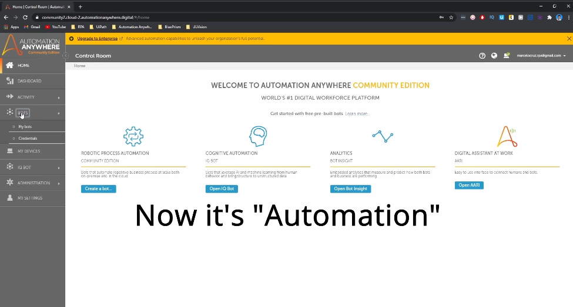

So now here on my bots, let's click here on the in this button where it says Create the bot.

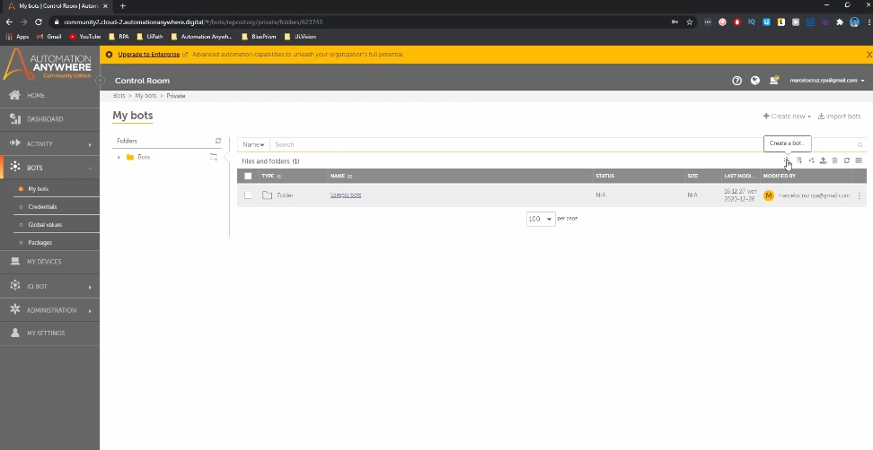

Here, we will give the name of the bot. For example:

`Bot Notepad`

And now click on Create Edit.

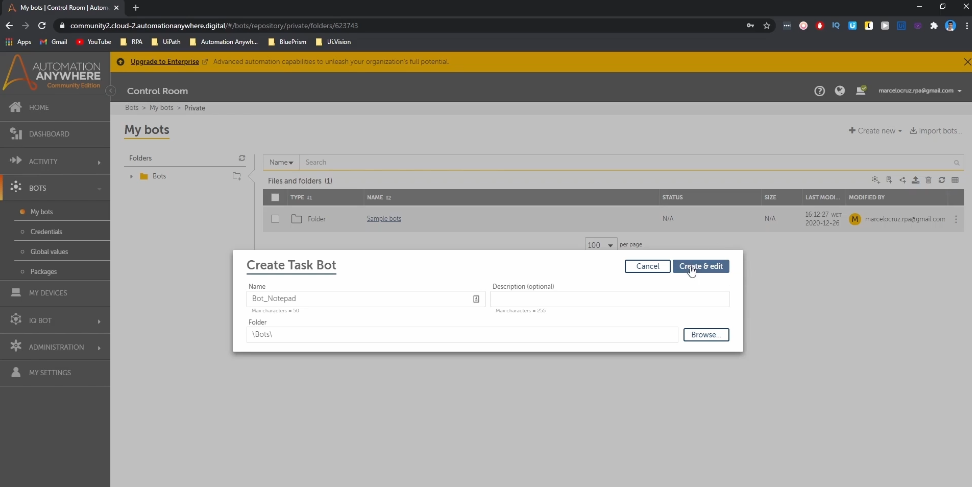

So we'll be here that we will develop our bots.
So we need now to think what is the first thing that the bot will do?
The first thing in this case will be open the notepad.

So to open the notepad we need to use a action that opens a program.
So here, as you can see here in actions, appears here, a lot of actions.
So action is basically a action is that can be sent, the email can be extracted to open the browser.

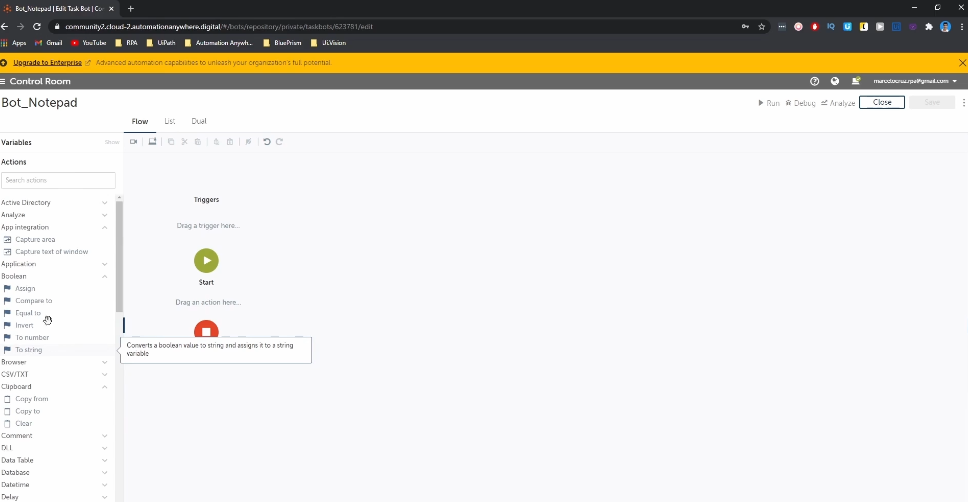

So in our case we need the action that opens an application. Here we will type open a program.

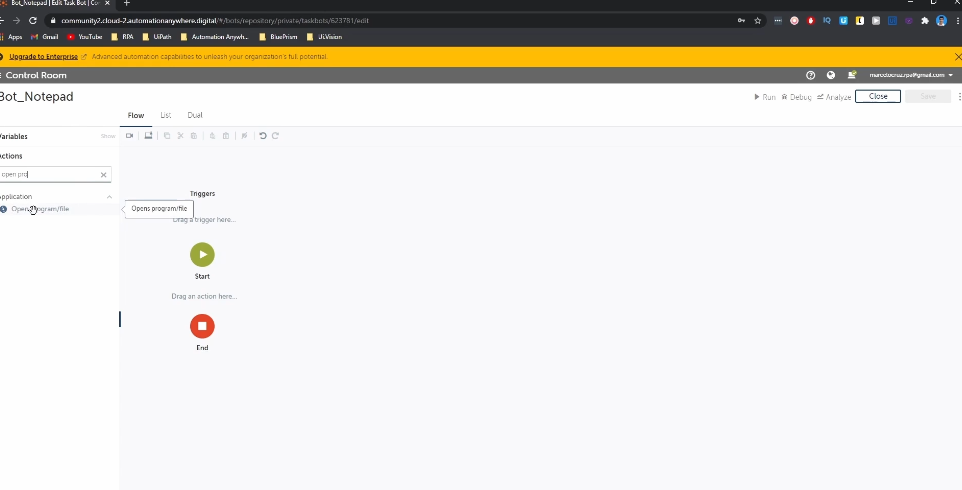

So here we can see a action color open program file.

So we will drag these action.
So after you drag the action to the automation will appear to you a tab that shows the action properties.

And so we need to say basically in this property is the location of our notepad.

So first we will here in the Windows Explorer type notepad.

And so like this.

And so we will click now in open file location.

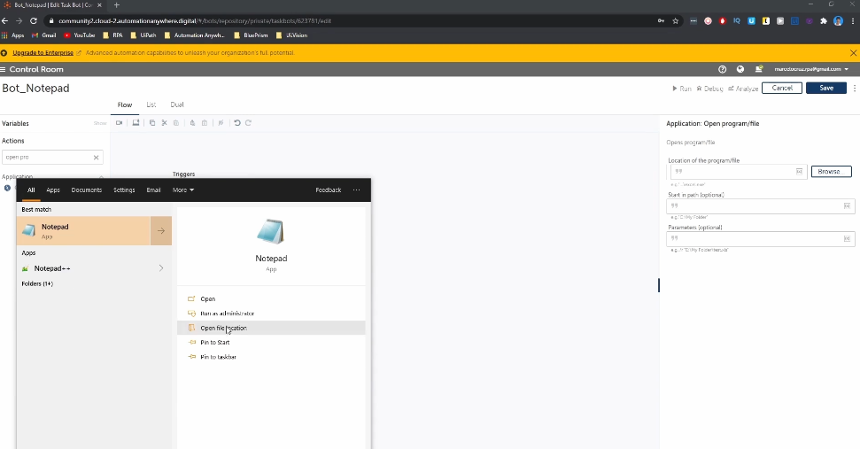

Here we have the shortcut of Notepad.

So basically click here on Notepad one time and go to home here and click on Copy Path.

And like this we will copy the full path of this shortcut.

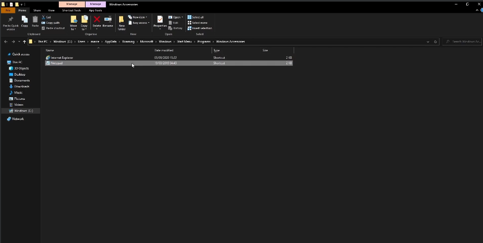

Let's close and click here and Ctrl V, just paste a remove the quotes like this.

Let's remove the quotes.

And now we if we run.

So let's here after you paste here the location, click on Run.

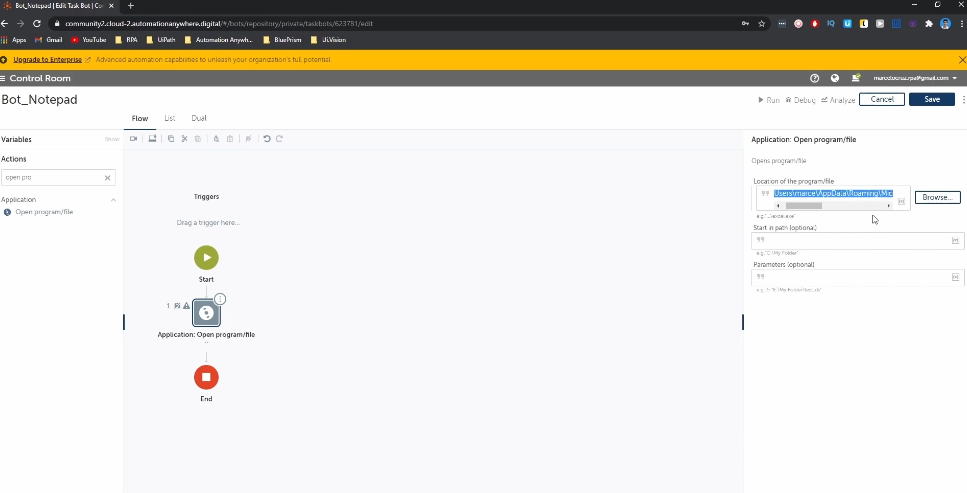

And after that we will see the notepad open.

So as you can see, we successfully developed the automation to open the notepad.

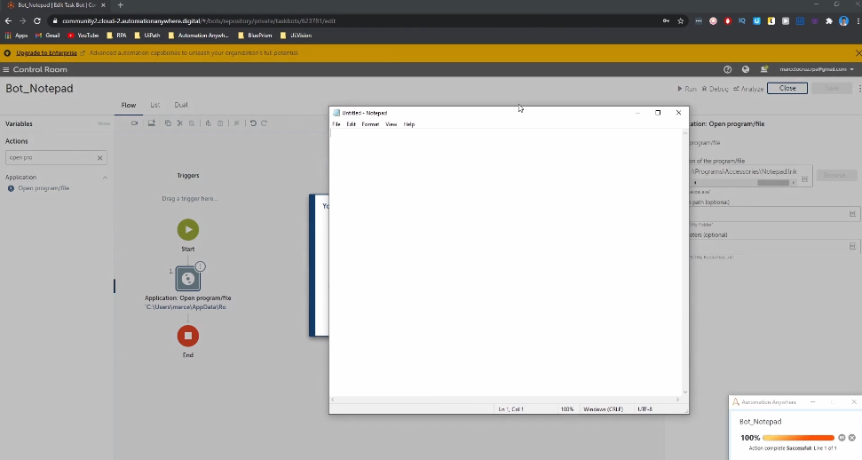

Now what we want is the bot type Hello world in the notepad.

So let's close here this message.

And now to type Hello world in the notepad in actions.

Let's type Capture in **Actions** menu. The action Capture will appear under Recorder.

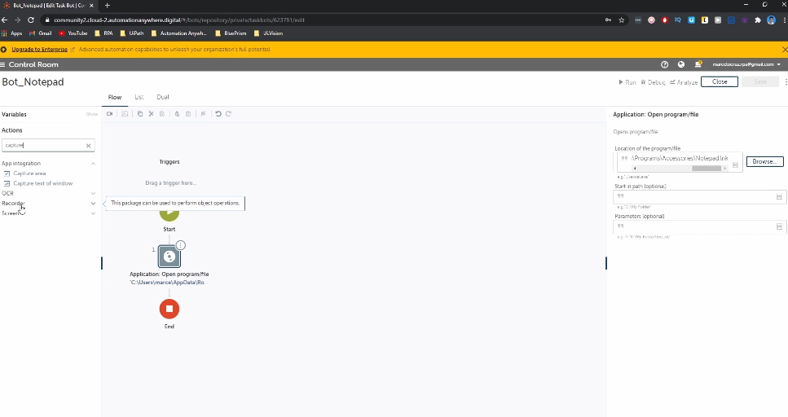

Drag it to the automation.

So after you drag the automation in this case, in this action, we need to say in the action properties, the application that we want to automate with the action.

So let's here in object detail, click on application.

And now if you click in this dropdown will appear these presets.

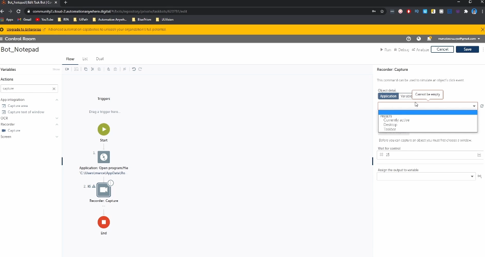

But we want to automate the notepad, but it doesn't appear here to appear in this dropdown where we

choose the the application that we want to automate, we need to click here in this signal, in this button where say refresh windows.

So click here.

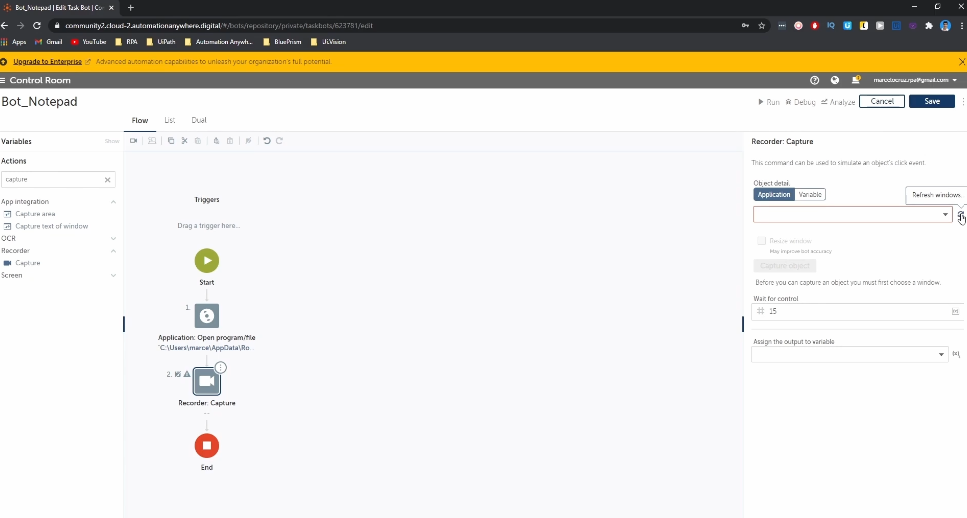

And after you click in this button, if you click here in the drop down, you will see the available windows that are open in your computer.

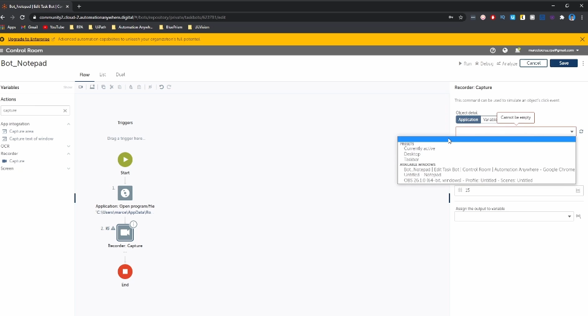

So you can see here the Google Chrome, the our control room, and we can see to the notepad.

So we click here on Notepad.

It needs to be open the notepad to to appear in this dropdown.

So make sure that you open the notepad.

And now we need to capture the object.

We need to indicate where we want to type the text.

So click on Capture objects.

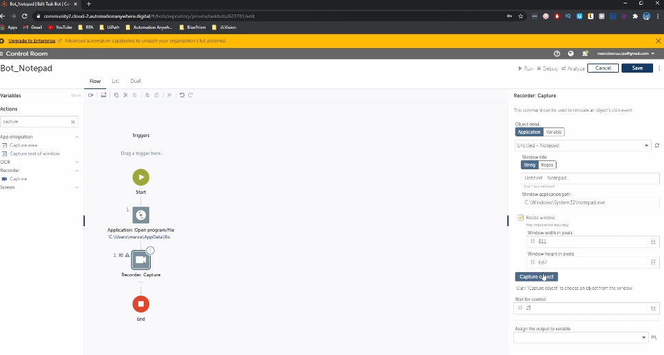

And now if you move the mouse, you will see here these red lines.

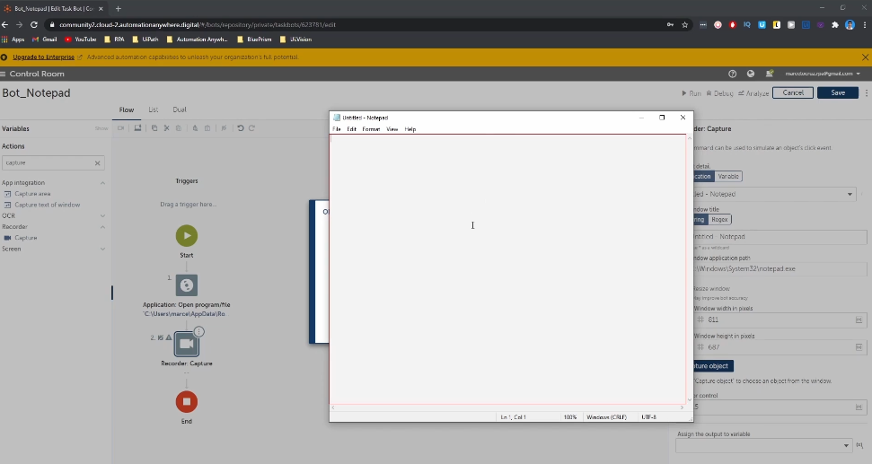

So like this you can see where we are indicating to to the to the action.

So we want to indicate the text area.

This this area where we can type text.

So when you appear these red lines like this click.

And now we can see here the area that we indicated to the capture action.

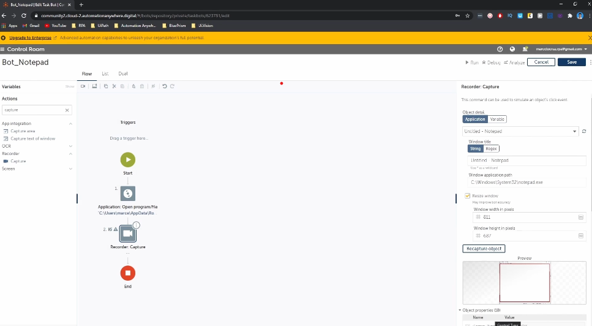

So let's now scroll.

And here in this option, we can set the action that we want to execute.

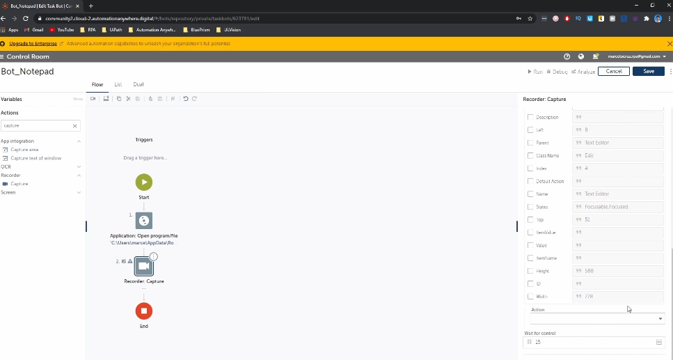

So let's click here and we can see here some actions.

But the action that we want is set text.

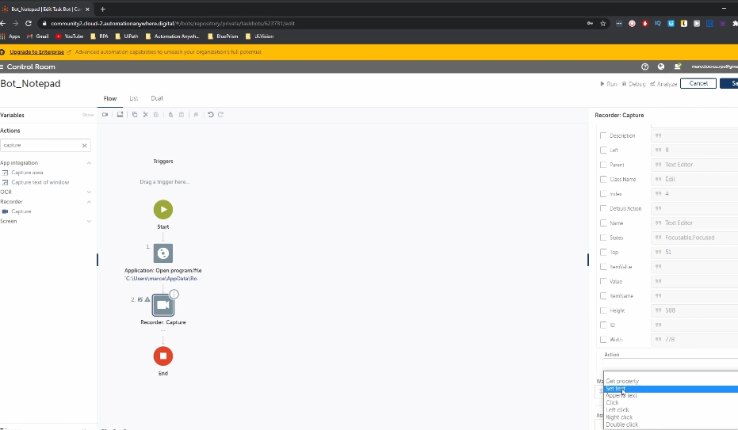

So we want to type text in the notepad.

So click here and after you select set text will appear some properties.

So the property that we want really to define is this one that we set.

We say that text that we want to the bot to type on the notepad.

So here let's type hello roles.

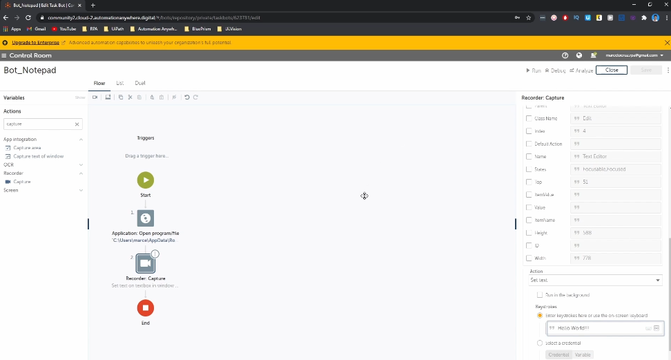

So now let's close our notepad because the bot will open again and now click on Run.

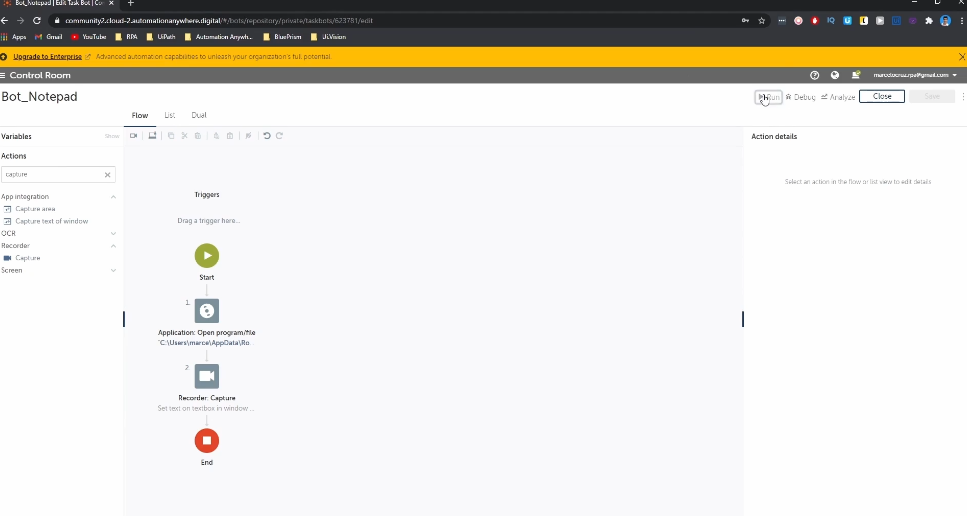

Let's click, click here on Run and let's see what the bot will do.

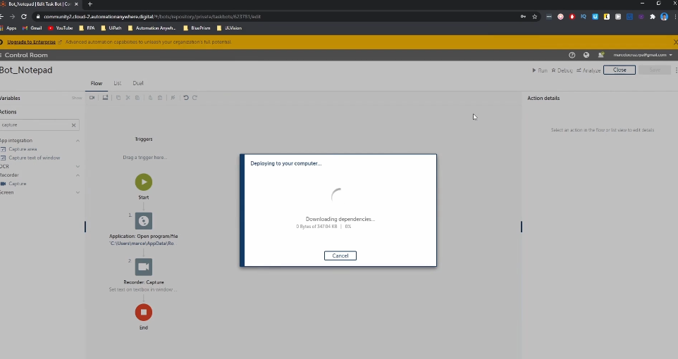

So the bot started to execute and now open the notepad and now we can see that the bot filled here, the text.

Hello world like we define it in the properties.

And now in the next section, we will dive more deeper into the control room.