## Lab: Deep Dive into Automation Anywhere

In this lab, we will get a deeper look into automation anywhere control room.

So first we will cover the main control room tips like dashboard activity and bot step

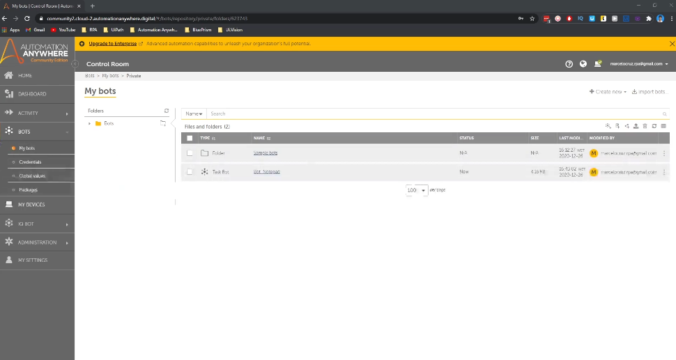

And then we'll cover the basics about the task.

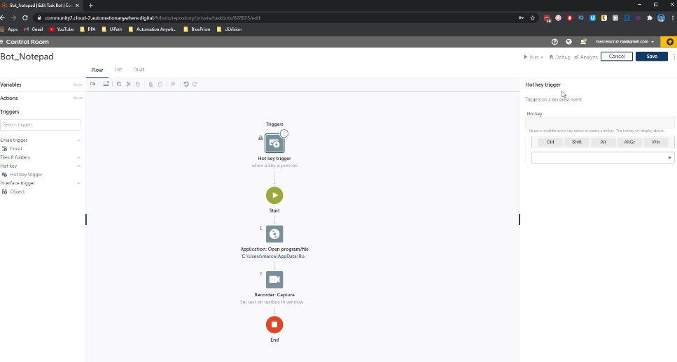

Bot development like variables will discover what's a variable triggers and will discover the recorder.

A useful automation anywhere feature.

So now we'll get to look into Dashboard page.

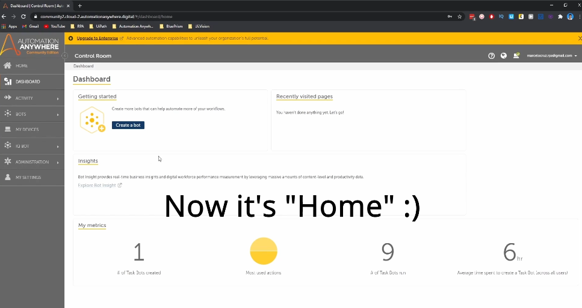

So like you can see here in Dashboard Page, we can create a bot from here clicking this button.

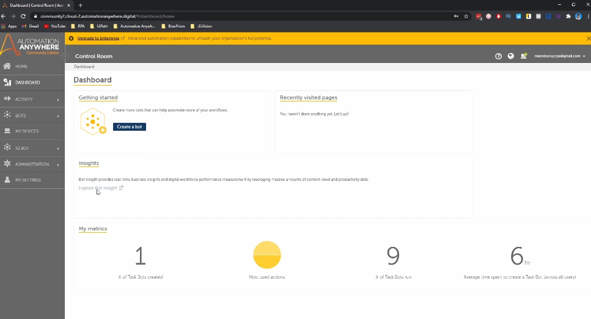

We have a link to access bot inside, so I will show you a bit about what inside.

So basically what inside is a platform from automation anywhere that gives us insights about automation

performance and we can get insights about the abusiness.

So we can see here by default we have two dashboards.

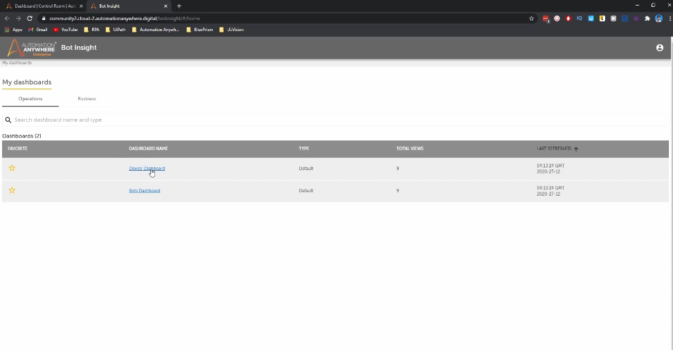

For example, we will access the device dashboard and we can get insights about the devices that are

connected to control room.

So like we can see here, we have one online devices is our device, our computer.

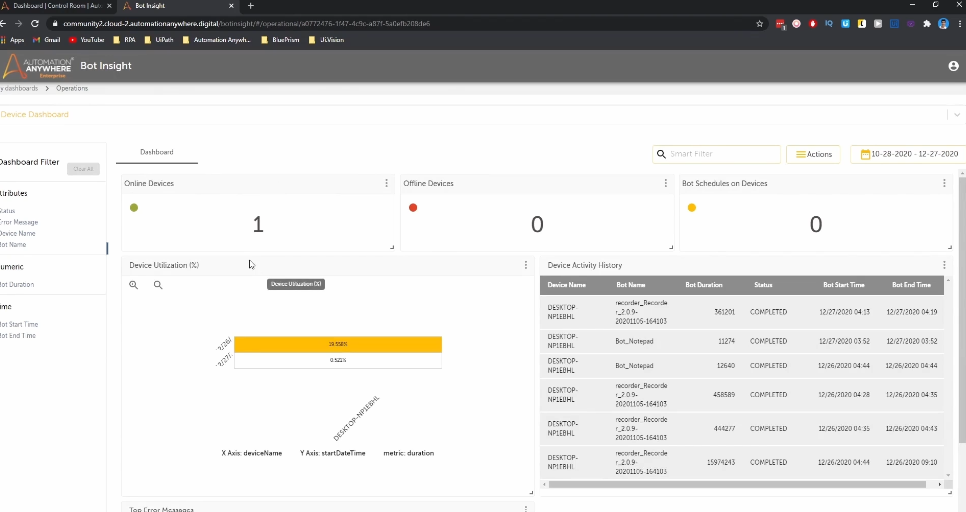

We can get insights about the device utilization and device activity history.

So it's a platform that gives us insights that can be useful.

And then in Dashboard page, we get some metrics like task bot skill.

It's basically the number of automations that we created.

So I have here only one because it's my new account and most user actions is the actions that we use

at most.

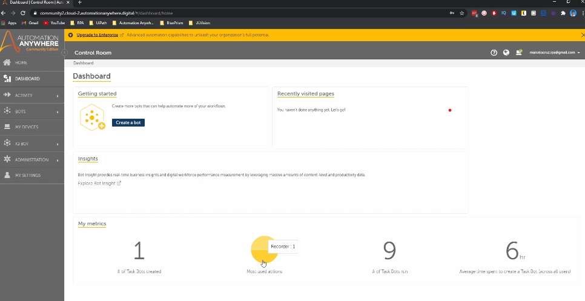

So basically you will get like me, the application unrecorded because what's the type of actions that

we used in our first task?

What the notepad task what?

That's what runs is the number of times that we run our automations, the task bots.

And here we get the average time spent creating a task bots and automation.

So this page allows us to track the automations, the task bots that are running in real time and gives

us the historical about the task bots executed.

So here in progress we can track the bots that are currently running.

So for example, let's copy this variable and open a new tab and we will run the notepad bot that we

developed.

So for example, let's go to bots, my bots and we will see then the bot notepad

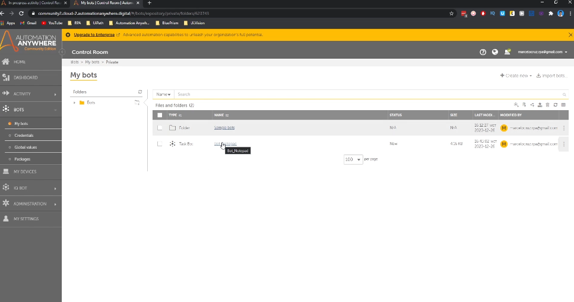

the bot that we developed and if we run the boat we can see here will appear then the bots that is running.

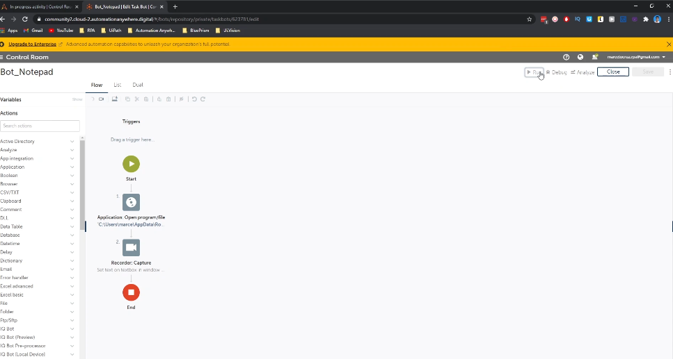

So just wait a bit.

And we can see here what is running active.

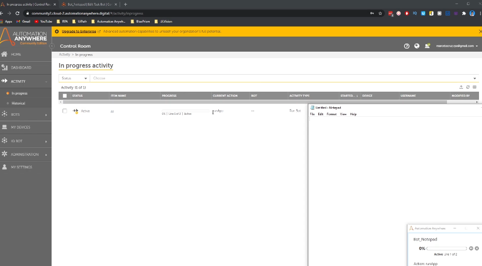

We can see here the info.

Let's close the notepad.

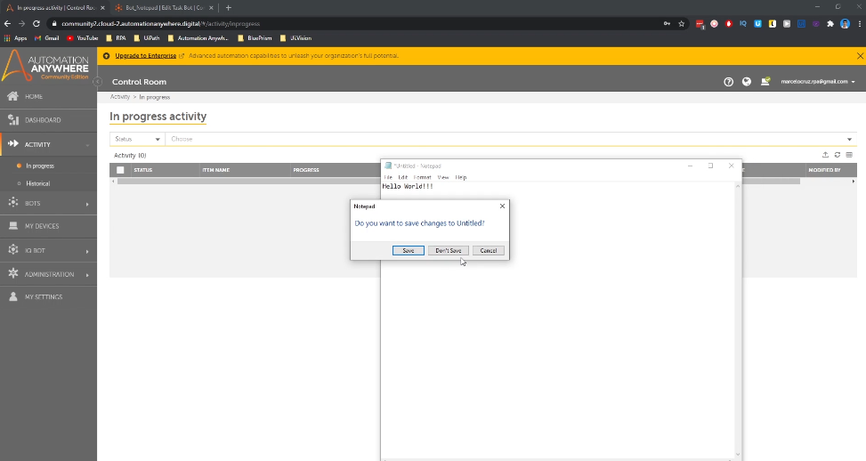

And here in historical, we can see the end of the death squads, executions.

So for each execution and the execution, we can see here the status, if it's completed, if it was

successful or if it failed.

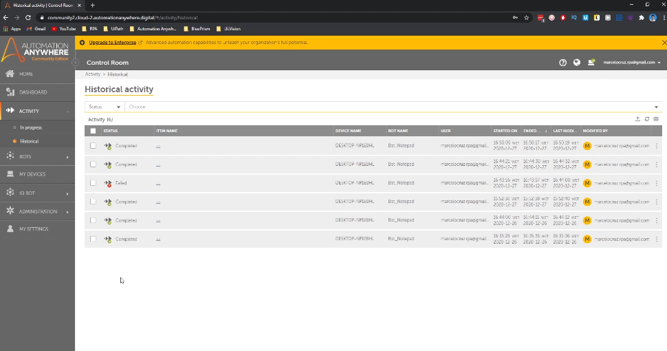

We can see the device name where the task bot was executed.

We can see the bottom name, the name of the automation, and we can see when the test, what was executed,

the hours and the day, and we can see to when the execution ended here.

