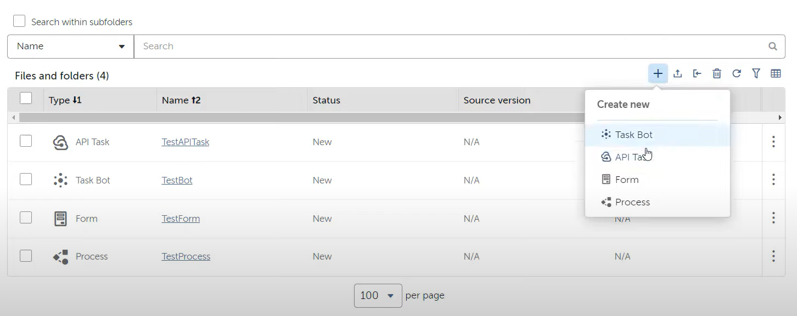
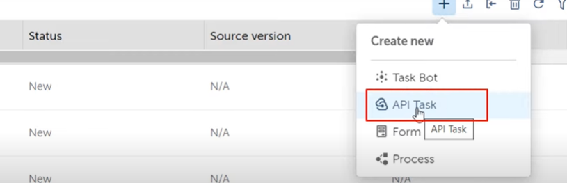
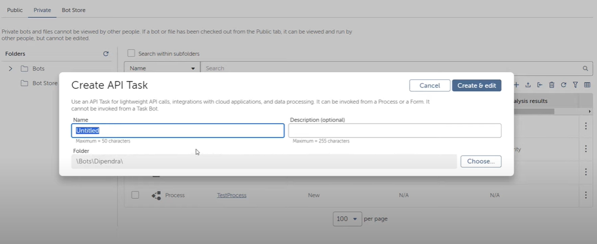
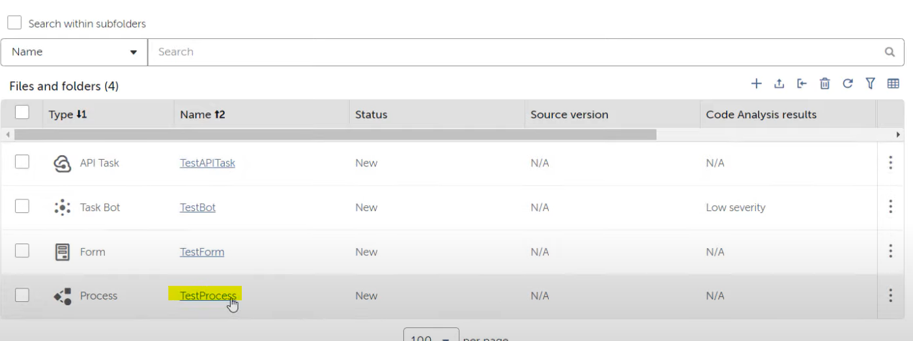
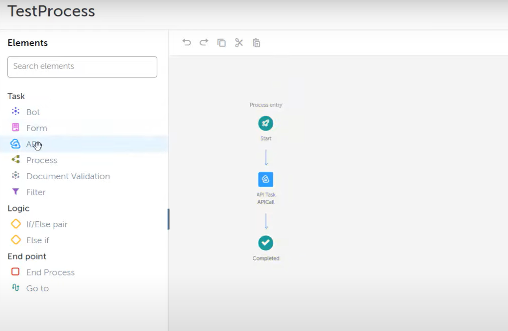

# Lab: API Task

## Introduction
In this lab, you will explore the new task available in the Automation Anywhere A360 platform called the API task. This lab will guide you through creating and configuring an API task within the Automation Anywhere environment.

**IMPORTANT:** This lab can only be done with Enterprise Automation Anywhere edition. API task feature is not available in Commmunity edition.

## Objectives
- Understand the purpose and functionality of the API task.
- Learn how to create an API task in Automation Anywhere A360.
- Integrate API tasks into your automation workflows.

## Prerequisites
- Access to Automation Anywhere A360 platform.
- Basic understanding of RPA concepts and tasks.

## Instructions

### Step 1: Log into Control Room
1. Log into your Automation Anywhere Control Room.
2. Click on the plus icon to explore new tasks. Notice the API task option alongside other tasks like Task Bot(RPA), Form and Process Orchestration. Process orchestration like when you want to create a process composer for your co-pilot automation.

### Step 2: Create an API Task
1. From within a folder or the control room level, select the option to create a new API task.
2. Note that creating an API task is similar to creating an RPA taskbot.

### Step 3: Configure the API Task
1. Access the test API task you've created to enter the configuration interface.
2. Observe that the workspace interface is similar to that of creating an RPA task, with differences in the list of available actions. Most actions here are relevant to API tasks, focusing on API endpoints.

### Understanding the API Task
- API tasks are specialized for operations involving API calls, omitting unnecessary actions like message boxes since API calls return responses directly.
- One significant advantage of API tasks is that they do not require a runner machine for execution. They run on Automation Anywhere's provisioned runner machines, ensuring faster execution as all necessary resources and configurations are pre-loaded.

### Step 4: Integrating API Task into Processes
1. Explore creating a test process to integrate your API task.

2. Understand how the API task can serve as an entry point or a part of the process flow, especially after executing RPA or form tasks.
3. Learn to drag and drop the API task into your process flow and configure it to perform API calls, such as fetching data from Salesforce, Workday, or ServiceNow.

### Conclusion
- API tasks streamline the execution of API calls within your automation workflows, offering a faster and more resource-efficient alternative to traditional bot-based API calls.
- Practice creating and integrating API tasks into your processes to enhance automation capabilities.
