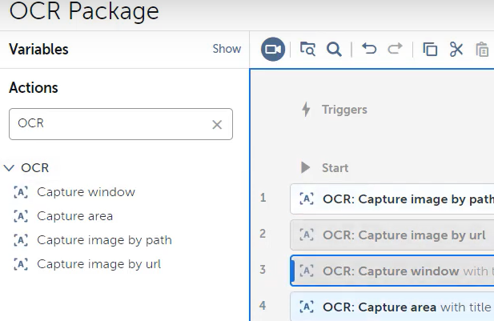

# Lab: OCR

## Overview
Welcome to this lab on OCR (Optical Character Recognition) package in Automation Anywhere A360. In this lab, you will learn how to use the OCR package to extract text from images or PDF documents.

## Objectives
- Understand the OCR package and its actions in Automation Anywhere A360.
- Extract text from an image using the OCR action.
- Apply filters to the extracted text.

## Prerequisites
- Access to Automation Anywhere A360 platform.

## Steps

### Step 1: Introduction to OCR Actions
1. Access your Automation Anywhere Control Room.
2. Create a new task and name it `OCR Package` to explore OCR actions.

2. Search for `OCR` in actions menu.

We have currently above actions in under the OCR package and form of OCR is optical character
recognition. We will use all of these in this lab.

### Step 2: Capture Image by Path
1. Drag and drop the `Capture Image by Path` action into your task.

2. Specify the path of the image from which you wish to extract text. You can upload the image to the control room or use a desktop file.

**Note:** The OCR folder in the GitHub repository contains multiple images with text. Feel free to use any of these images for text extraction tasks.

`https://github.com/fenago/automation-anywhere-next-level/OCR`

3. Assign the extracted text to a variable, e.g., `sValueFromImage`.

4. Display the extracted text in a message box to verify the output.

### Step 3: Run OCR Action
1. Select the language for OCR based on the options available (English, Japan, or Russian in the Community Edition).

2. Run the bot to extract text from the specified image.

### Step 4: Filter the Captured Text
1. Use the `Filter Captured Text` action to refine the output.
2. Specify the before and after text to extract specific information from the captured text.
3. Run the bot again to see the filtered result.

**Note:** Adjust the `Before` and `After` values according to the text in your image.

### Step 5: Task - Additional OCR Actions
1. Explore other OCR actions like `Capture Image by URL`, `Capture Window`, and `Capture Area` to extract text from different sources.
2. For `Capture Window`, specify a window or browser from which you want to extract text.
3. For `Capture Area`, select a specific area in an application or browser to extract text.

**Note:** Ensure that you explore and utilize all available options within the OCR actions.

### Conclusion
You have learned how to use the OCR package in Automation Anywhere A360 to extract and filter text from images and documents. Experiment with different OCR actions to enhance your automation tasks.

### Next Steps
- Try extracting text from various image formats and documents.
- Explore advanced OCR settings and configurations to improve accuracy.
