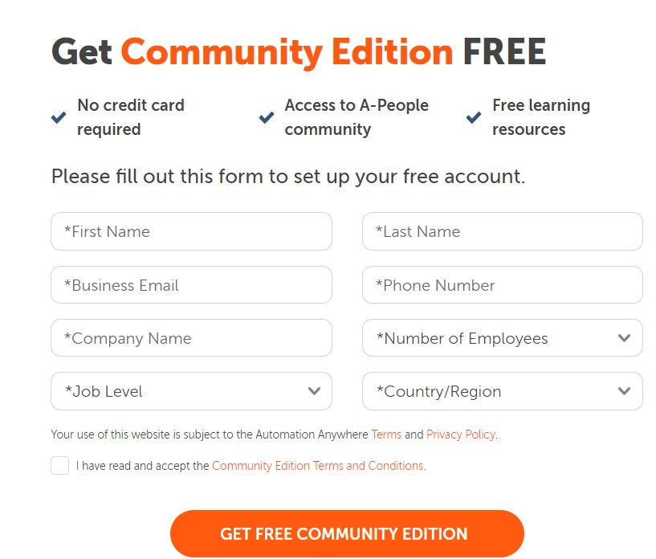
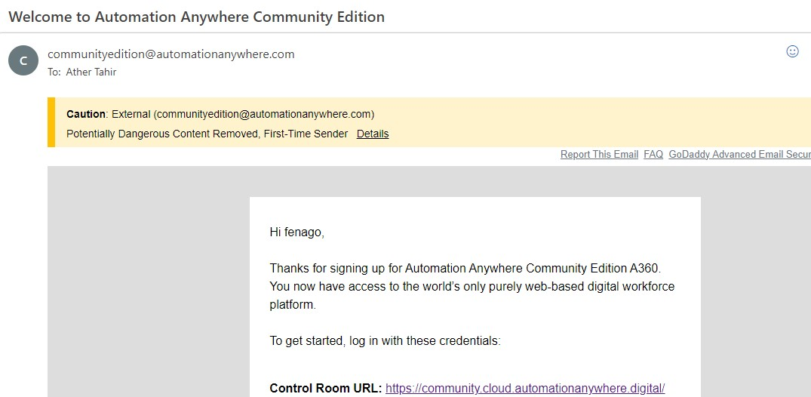

Lab 1: Automation Anywhere Setup
================================

In this lab, we will be setup Automation Anywhere Community Edition.

Community Edition  
-----------------

Community Version  is a fully cloud-based solution. The bot
management and building are all done through the web application. No
development client is installed on your desktop. Each device that you
will run the bot on will need to download and install a **Bot agent**.
Once installed, you build your bot, then connect
to your device using a Bot agent, and then deploy.

### Registration with Automation Anywhere

As Community Edition  is free, you can start using it once we have registered with AA.

To register, follow these instructions:

1.  Navigate to
    <https://www.automationanywhere.com/products/enterprise/community-edition>.
2.  Complete the appropriate details, including your **First Name**,
    **Last Name**, **Email Address**, **Country**, **Phone Number**, and
    **Company Name**.
3.  Then submit your details.

You will shortly get a welcome email including your login credentials.
The key details to note are the following:

-   Your Control Room URL
-   Your username
-   Your password

You will need these credentials every time you launch AA so keep a note
of them. You need to change the password when you first log in.

You are now ready to start your RPA journey using AA.

In the next lab, you will be guided through the installation process
of AA. This will be done through step-by-step instructions to get you
ready to start taking a closer look at the AA interface.
