## Lab: Automation Anywhere Setup

In this lab, we will set up the automation anywhere in our machine.

**Note:** We will use Google Chrome browser to complete the labs.

So first we need to create a free account in automation anywhere.
So let's on Google, for example, search for `Automation Anywhere Community Edition`. It's the free edition to use.

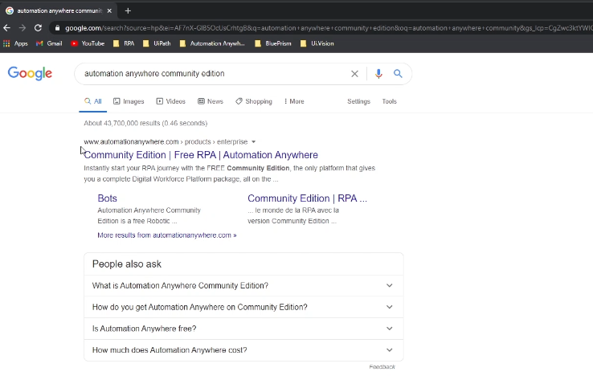

So we will click in the first result on where it says Community Edition.

Now we need to fill here the required information.

Complete the appropriate details, including your **First Name**,
    **Last Name**, **Email Address**, **Country**, **Phone Number**, and
    **Company Name**.

Accept the conditions here and if you want to receive communications from automation anywhere about the products and services you can.

So check here the checkbox and now click on Get Free Community Edition and our request has been submitted.

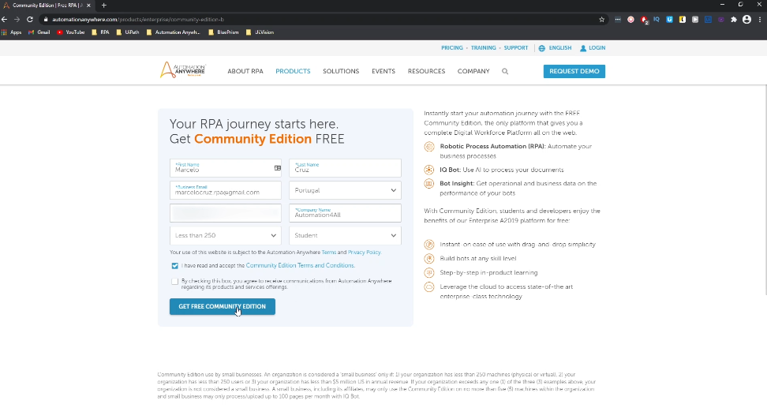

Now we just need to wait some minutes to receive an email to that contains our account credentials that we need to log in on our account.

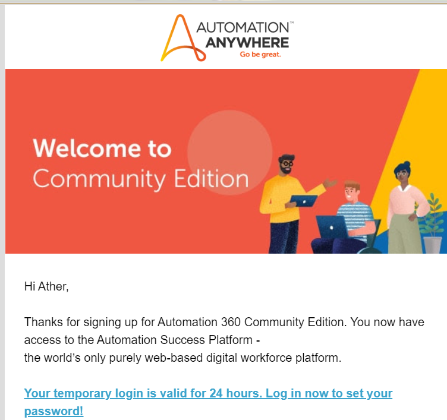

Email will container your credentials and the control room variable that is control room is where we will develop our automations.

And open another tab in the browser. Enter your username. Type your email and in password type the password that you received on the automation anywhere email.

So let's log in here.

I will type my email, the credentials and click in login.

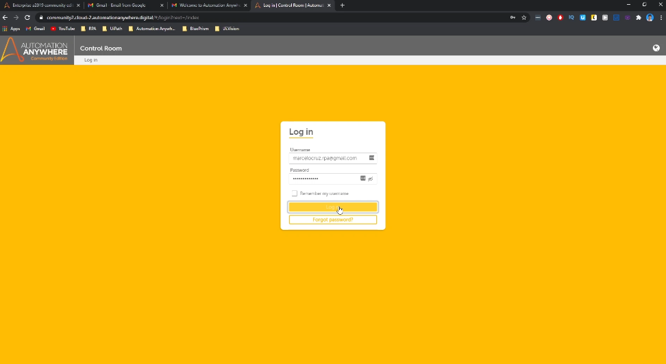

Now the platform will ask you to change the password.
So here we will type the the credential, the password that we received in the email.
And now here type your new password.
And finally save the change to apply the new password.

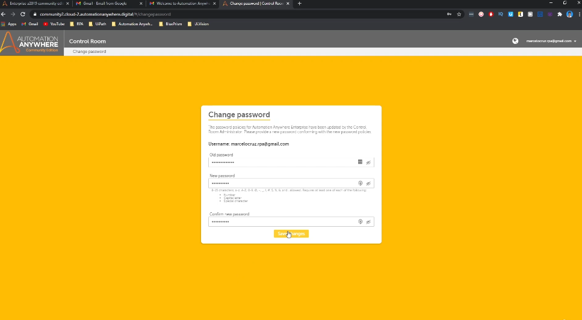

So now we are on our control room is here where we will develop our automations.

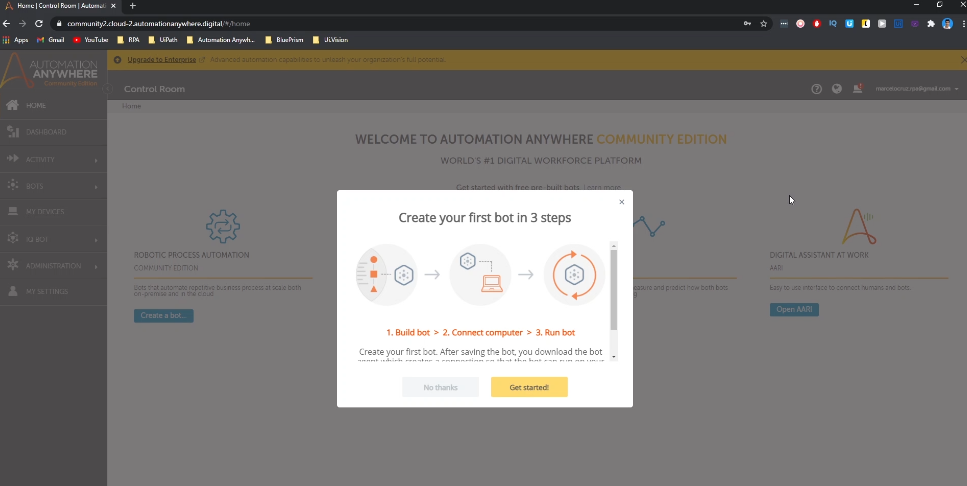

But before starting learning how to automate with automation anywhere, we need to install the bot, the robot in our computer. For that, let's here just skip the small tutorial type here.

Set the language to English.

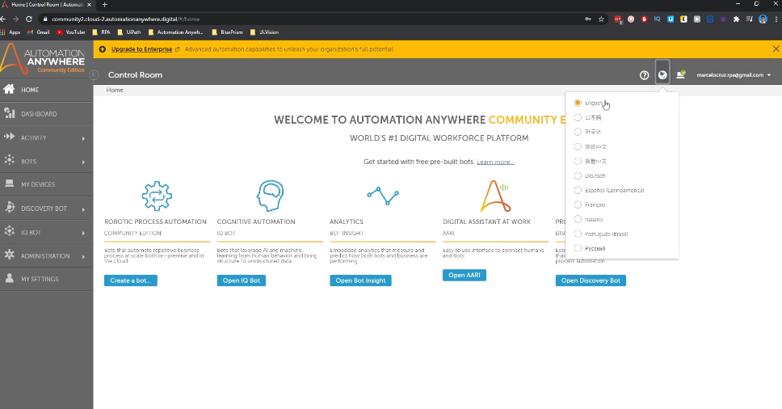

And now click computer icon.
And now we will click here in Connect Device.

So first, let's click here in `Connect to my computer`, and now we'll be downloaded an executable that will install the bot agent in our computer.

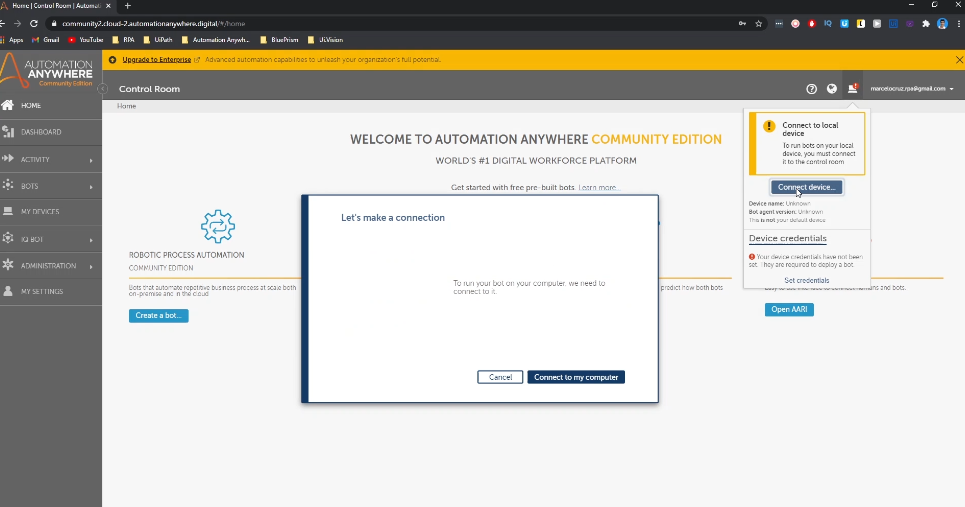

Let's wait just a bit.

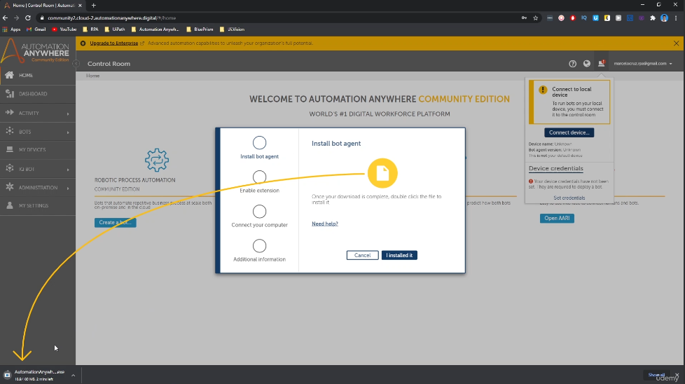

And now let's run the installer.

So now the bot agent is installed in our computer and then will appear to you in your web browser that the automation anywhere extension was added. And we need to enable the extension.

So, click on enable.

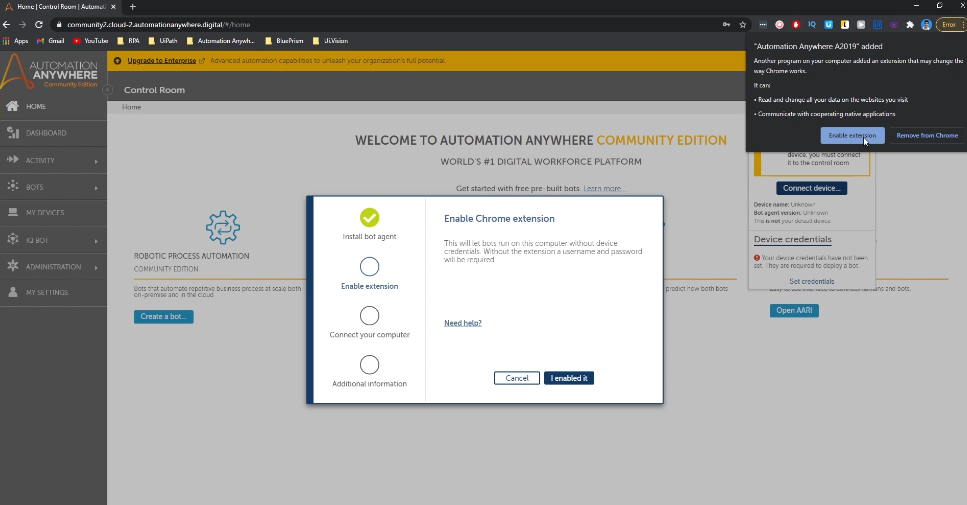

Google Chrome is the web browser that we will use on this course.

And now here we can add a nickname. Let's click on Done.

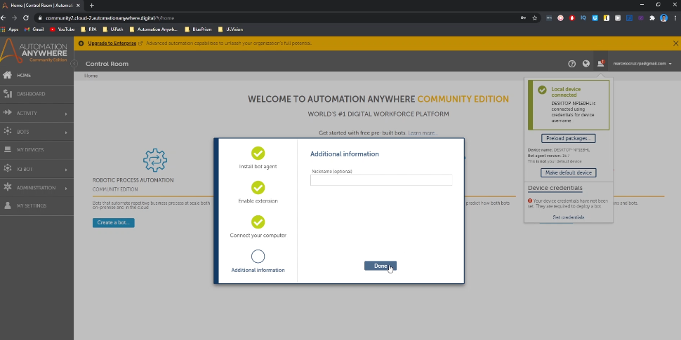

And now we have our computer connected with Control Room.

We have completed 100% the setup of automation anywhere on our machine in our computer. And now we have ready to start automating.

In the next lab, we will develop a simple automation that will open a notepad and type some text.

