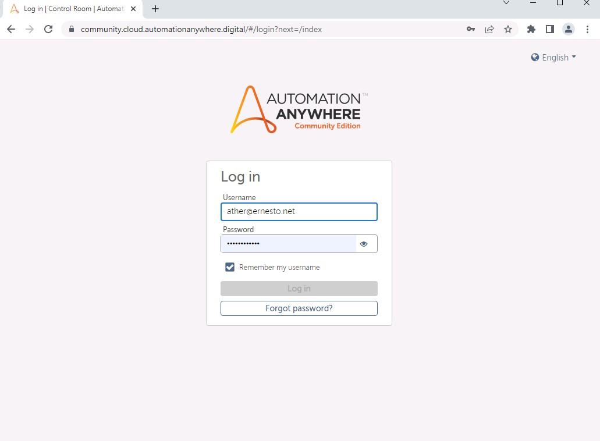
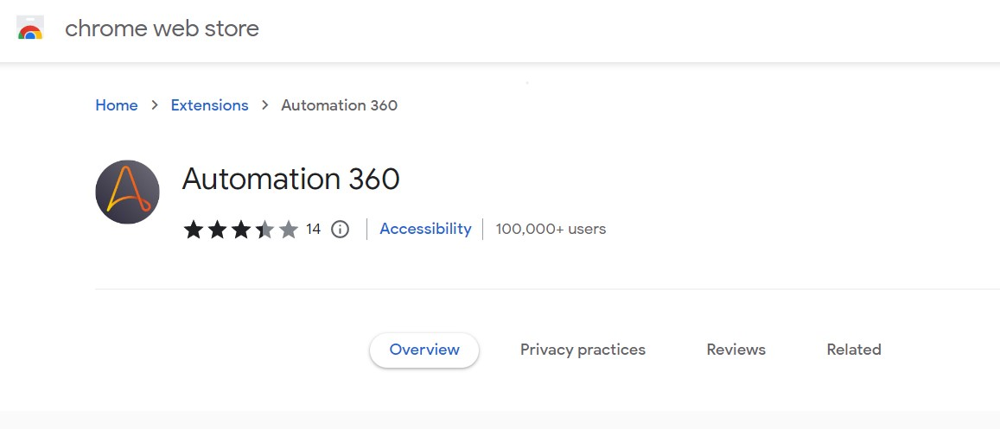

Lab 2: Installing Automation Anywhere 
======================================

We will cover the following topics in this lab:

-   Connecting to **Control Room**
-   Preparing your device
-   Configuring profile and device credentials

Connecting to Control Room 
==========================

Continuing from *Lab 1*,
About Automation Anywhere*,
after your registration with
Automation Anywhere is complete, you should have received an email with
the following details:

-   Your Control Room URL
-   Your username
-   Your password

Let\'s start by logging into **Control Room** and getting familiar with
the interface.

Launching and logging into Control Room 
---------------------------------------

As Automation Anywhere is
100% cloud-based, the platform is a totally web-based application. As
such, we need to run Automation Anywhere from our web browser. I am
using Chrome, but Internet Explorer can also be used to launch
Automation Anywhere:

1.  Copy the **Control Room** URL details from your registration email
    and enter this URL into your web browser address bar:

    
    
    

2.  Next, enter the **Username** (this is usually
    your email address), followed by the
    **Password** sent in the email from Automation Anywhere.

3.  Click on the **Log in** button. When you have successfully logged
    in, you will be navigated to the **Home** page:

You have managed to log in to Automation Anywhere
**Control Room**. The top right shows the user
details, while the left-hand pane has all the different sections of
Control Room.

Updating your profile and password 
----------------------------------

The first thing you may want to do is update your
profile and set a new password:

1.  In the botton left-hand corner of the **Home** page, click on your
    profile icon:
    
    
    

2.  From the dialog box, click on **Go to My settings**:
 
    
    
3.  This will take you to your profile details
    interface; to make any changes to your
    profile, click on **Edit**:

    
    

4.  This will allow you to update your details.
    Here, you can update your **password**; once
    you have made your changes, click on **Save changes** to apply them:

You are now successfully connected to **Control Room** and have configured it to your liking.
Every time you want to launch Automation Anywhere, you will navigate via
your browser to the URL given and use your credentials to log in. Now
let\'s prepare your device.

Preparing your device 
=====================

When bots are built, they need to be run on a
device. This device can be a physical desktop, laptop, or even a virtual
machine. We need to install and configure all devices that we may want
to run a bot on. With this free edition of Automation Anywhere, we can
add only one device.

To add a device, two stages are involved:

-   Installing a Bot agent
-   Enabling the extension

Let\'s go through each stage now.

Installing a Bot agent 
----------------------

The Bot agent is a small application that allows
the device to communicate with the task bots. To install the Bot agent,
follow these steps:

1.  Click on **DEVICES** from the left-hand menu bar, then click on
    the **Connect Local Device** icon:

    
    

2.  The connection wizard will pop up. Click on
    **Connect to my computer**:

    
    

3.  The wizard will start to download the Bot
    agent (into your default downloads folder) as shown in the following
    screenshot:

    
    
    

4.  Once the Bot agent has been downloaded,
    right-click on the downloaded file\'s icon and select **Open**:

    
    

5.  This will initiate the Bot agent install
    wizard. Follow any onscreen instructions to install the Bot agent.

6.  Once it has been installed, you will notice a green tick in the
    **Install bot agent** step. This green tick indicates the successful
    completion of that task:

The wizard will automatically lead you into the
next section for enabling the extension.

Enabling the extension 
----------------------

If you are using Google Chrome as your browser,
Automation Anywhere will need to enable an extension for this. This
allows Automation Anywhere to identify and interact with web-based
objects for automating your bots.

1.  When you prompted, click on **Add to Chrome** button and you will
    get the following prompt; click on **Add extension**:
 
    
    

2.  This will install and enable the extension. To view or disable the
    extension in Chrome, navigate to **Settings** \| **Extensions** and
    the Automation Anywhere extension should be visible:

    
    
    

3.  Once the extension has been enabled, the
    progress indicator will be updated with further green ticks.
    
4.  Finally, to complete the installation, click on the **Done** button.

5.  Looking at **Devices** in **Control Room**, you will now notice
    your device listed:
  
    
    
6.  The Bot agent should now be successfully installed on your device.
    You will also notice a little green tick against your local device
    icon on the top pane:

    

**Note:** You can ask extension manually by searching `Automation 360` in Google web store.

We now need to configure the device so that
Automation Anywhere can log in to it, even if no one is logged in to
that device or if it\'s locked.

Great work! We have now got our device all ready
to start working with **Control Room**. **Control Room** is set up with a user profile and a device.

Summary 
=======

We are all ready to get going now. You will be comfortable in the future
with setting up and configuring a device with Automation Anywhere
Control Room. You could have a number of devices installed
in **Control Room**. Once a bot is built, it can be deployed to any one
of them or even a number of devices. Installing and configuring devices
is an essential part of deploying and testing bots, and Control Room
provides a centralized location to manage all your devices easily.

In the next lab, we will look more closely at the **Control Room**
features. We have already looked at setting up devices, but there is a
lot more to it. We will learn about the dashboard, and how your bot is
managed and monitored. This will get you more familiar with the
**Control Room** interface used in Automation Anywhere.
