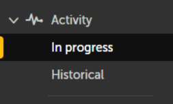
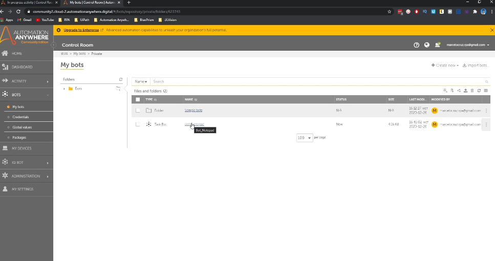
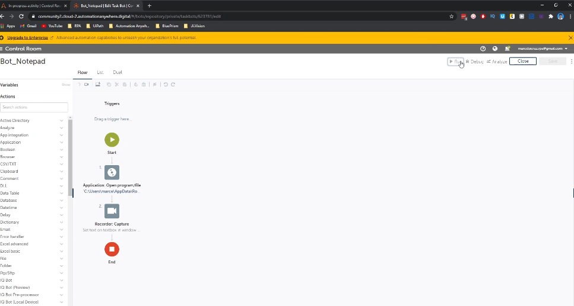
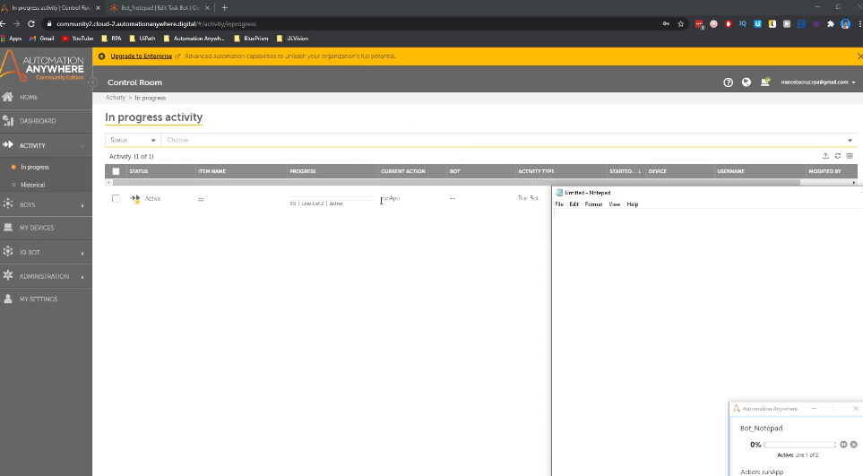
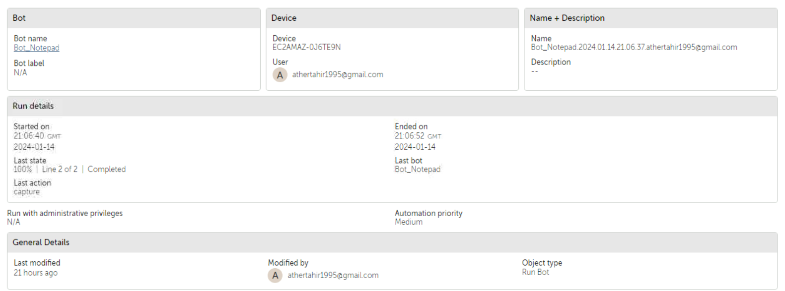
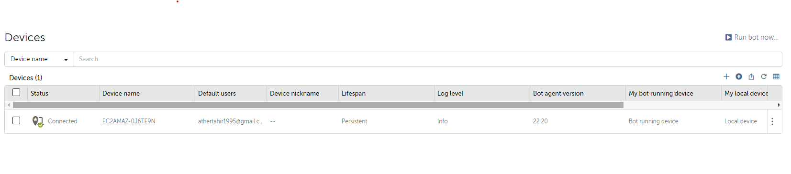

## Lab: Deep Dive into Automation Anywhere

In this lab, we will get a deeper look into automation anywhere control room.

# Exploring the Activity Tab in Automation Anywhere

## Introduction

This lab is designed to provide a comprehensive understanding of the Activity tab in Automation Anywhere. This tab is crucial for monitoring and managing the activities of your bots.

## Prerequisites

- Access to Automation Anywhere.
- Basic familiarity with Automation Anywhere interface.

## Lab Overview

- **Section 1**: Navigating to the Activity Tab.
- **Section 2**: Understanding the Activity Dashboard.
- **Section 3**: Monitoring Bot Activities.

## Section 1: Navigating to the Activity Tab

### Step 1: Accessing Automation Anywhere

1. Open Automation Anywhere Client.
2. Log in using your credentials.

### Step 2: Locating the Activity Tab

1. On the main dashboard, locate and click on the ‘Activity’ tab.

   

## Section 2: Understanding the Activity Dashboard

### Overview of the Dashboard

1. Familiarize yourself with the layout and the information displayed.

   

## Section 3: Monitoring Bot Activities

### Real-Time Monitoring

1. Learn how to monitor bots in real-time.
2. Understand different statuses like running, completed, and failed.

In progress page allows us to track the automations, the task bots that are running in real time and gives
us the historical about the task bots executed. So, here in progress we can track the bots that are currently running.

Let's go to bots and if we run the  notepad bot  we can see here will appear then the bots that is running.

So just wait a bit. And we can see here what is running active.

### Detailed View

1. Click on any bot activity to view detailed information.
2. Analyze the execution steps, duration, and outcomes.

   

## Section 4: Home, Devices and Packages Tabs

1. Click on Home Tab to get high level overview.

2. Click on Devices Tab to view connected devices.

3. Click on Packages to view the packages.

## Conclusion

By completing this lab, you now have a thorough understanding of the Activity tab in Automation Anywhere. This knowledge is essential for effectively monitoring and managing your automated processes.

