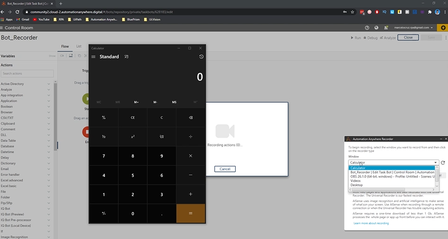

## Lab:	Understanding Types of Bots

So in this lab we'll discover the bots page. In Bots page, we can see the developer bots that we already developer.

So here we can see our bot notepad and we can see here a folder that is created by default.
So sample bots that has nothing.
We can create folders to organize better our automation. So basically, for example, we can create a sub folder.

Same for basically automation.
And you are course.
And we can put here a description and create a folder.

And then we click here on bots and we can see our created folder.

And if we want, put the developer automation, the task bots in this folder, we just need to go here, click on copy task bot.

Like here, for example, let's just delete this quick here on Browse, search for our created folder and just confirm and we can see click here on Copy now.

And now we can see that our automation in is in our created folder.

Other useful stuff here in my VODs for example, if you go here to a task, what if we go here?

We have some options.

So if click here we can delete the task bot here, we can copy the task bot here, we can edit the task

bot, but we need, we don't need to go through here.

We can click there and we already can edit the test bots.

Here, we can view the test squad.

Basically, we can see the design of our test squad.

Here analyze the.

We can analyze for analytics for both insights, but we don't develop this both for analytics.

So we will get nothing.

If we click here, for example, we can see if we click.

We'll see that we dashboard not available because we we have nothing targeting to analytics.

So let's close and here we can run directly from here.

Our task what's.

Credential space is where we can start with security sensitive data like passwords that we want to use

in our automations to log into applications emails.

So we'll use this page in one section in email automation so we will learn how to use it.

In global values is where you can see the values that are accessible to all automations.

Basically, the values that are accessible throughout bots are displayed here and in packages.

We can see the packages that we can use in our task bots.

For example, a package is a basket of actions.
For example, we have a package called Data.table that allows us to work with data tables.

Database package is basically a package that contains a bunch of actions to work with the database.

Now, we will learn variables.

So we will cover what's a variable and how to create one and how to use one variable.
So first, go to my page and click on the board.

Notepad the the first board that we develop that opens the notepad and set text.

So I moved my task board to the automation anywhere course and let's open the board notepad.

So when we open the our box, our task, what we can see here that the action step triggers and we can

see that the variables.

So first, what's a variable?

It's something that allows us to store a value or more than one value.

So in task bots, we have actions that need us to input values.

Like here in the recorder, we set the text that we want to type on the notepad,

for example, and we can do instead of typing directly the text here, we can use a variable to store the text and we can we can call the variable here that contains this value.

So let's first create a variable to create a variable, click on variables, click on the plus icon.

And here it's mandatory.

It's required to give a name to the variable.

So for example, let's put here message.

Uh, we can give a description to the variable, but it's optional.

Let's leave empty here.

This checkbox.

Let's leave empty.

We don't need to check them lately on the course we will use them.

And so we need to say the type of variable.

So string is basically type.

String is stored, text can be text numbers can be a mix of things.

Number is when we want a variable just to store numbers, we have then the date time.

This is basically for dates boolean for true or false.

So we have some types of variables.

In this case, the one that you want to use is string because it's text that we want to store.

And here in default value, we can set directly the value that you want store.

So will the Hello World.

So let's type here.

And now we just go create here the variable.

And now we can see here the variable created.

So let's go to the record capture action where we set the text and instead of.

Typing directly here, the text.

Let's clear the text.

So we have here two ways to call the variable.

So one of them is the dollar sign.

And we can see here, just click here on STR message and we are already calling the variable.

Other way is clicking here in insert a value.

It's the more simple way.

Maybe click here on the dropdown and select the message and click yes insert.

So in this way we are calling a variable that contains the text.

Hello world.

So now if we run the our automation, let's click here on Run, we will see that the our automation

will type in the same way the text Hello world.

And now the automation will open the notepad and we will see then the railroad appearing.

So like we can see appears here, the yellow roll in the same way.

And so, it's this basically the variables in a simple way, it's to store values through the

course.

We'll use variables to receive outputs from actions to give, to give values to actions.

So we will use them.

We will learn triggers.

So here on our bot notepad task bot, let's click here on triggers.

And a trigger enables a task to run automatically in response to an event that occurs on our device.

So we can see here that we have some types of triggers.

Email trigger basically is can be some type of email that makes our task bot run automatically executing

and we have hotkey trigger in the first trigger.

So in this case, just to be simple, we will use the hotkey trigger.

So we can see here on our bot that we have a section called Trigger.

So here we can drag a trigger that we want to use to enable a task, our task to run automatically.

So let's drag here our hotkey trigger.

And so here in the hotkey trigger properties, we have to define hotkey that will run automatically

the bot that will make the bot run automatically.

So for example, in our case we can use, for example, the control and let's use for example, the

A we, you can use a letter that you want or the hotkey.

And so in this way when you run a bot, the bot will wait for this hotkey to execute our automation.

So let's save and now let's run our bot and we can see the run now on or run with Trigger.

So let's click on Run with Triggers and the bot is starting deploying in our computer and we will see

that the bot is listening for trigger.

So, so the bot just executes if we click on this combination hotkey control plus A so.

If we click on control and a let's see what will happen.

The bot will execute.

So this is a very useful feature to execute automatically.

Automations.

So now we discover the is full feature and in the next video, the next lab we will learn the recorder.

A nice feature from automation anywhere.

Now we will cover the automation anywhere recorders.

So let's create a new task bot.

So here on my bots, go to the crib folder and let's here create a new task bot.

So let's click here on Create the Bots and let's give the name of bot recorder, for example, and let's

click here on Create Edit.

So now in our bot recorder, uh, in this button, we can use the recorder.

So basically the recorder allows us to record our actions in certain window and it can help us to develop

a bit more faster our test bots.

So first we need to say the window that we want the recorder to record our actions so we can see here

the open windows in our computer.

In this case we will record just our calculator.

For example.

First let's open here the calculator.

And to appear here in window in this dropdown.

Let's refresh here the windows and like we can see here appears the calculator.

So now let's choose the recorder.

We have the universal recorder and the sense recorder.

The universal recorder is the recorder that we must use to record the web pages, applications of our

desktop and a sensor recorder like we can see here, use image recognition and artificial intelligence

and is not use in remote desktops in Citrix environments or when our universal recorder has struggled

to capture our actions.

So in this case, we will use the universal recorder.

So let's click here.

And now we can see that recorder is on.

So we will start clicking here on our calculator.

The recorder will record our action so we can see here the red line appearing.

So.

For example, I click I will click here on the eighth.

And the vote will record my action.

Now I will click on the plus icon and the vote recorded my action.

Let's click on the nine, for example, and let's click on the equals to make the the sum so the votes

create my actions that I did on the calculator so we can hear pause the recorder.

Imagine that we want to stop the recorder.

We can stop the recorder now we can resume, for example, if we want to click, if we want to do some

more actions.

And after we did all the actions that we want to do in the window in the calculator, we just click

on finish and we will see here, like we can see here the actions that we did on the calculator.

So now let's clear here our calculator.

Let's, let's put on the state that it is when we open our calculator.

And now if we run the automation, let's see what will happen.

So we can see that the bot is doing our actions.

So, so the recorder captured our actions and translate it to actions so can be useful to develop a

bit more faster the test bots.

And now that we know already the basics to develop test bots, we will start to develop use cases

to learn how to automate with automation anywhere.

So in the next section we will develop a use case that will use the web browser.

So we'll be about web automation.