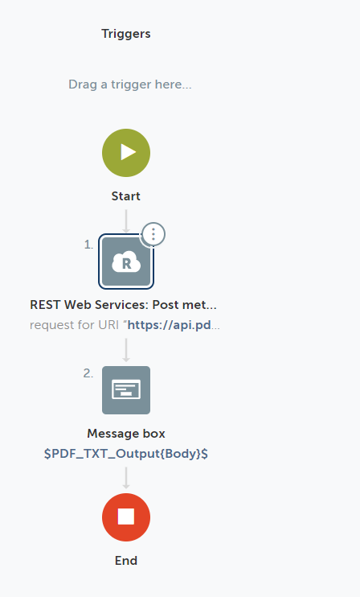
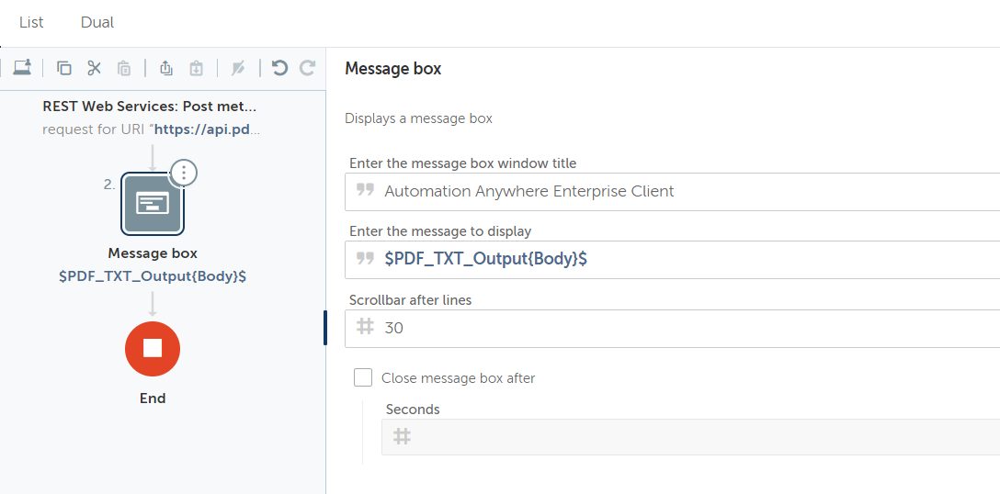

### Lab: Using REST Action

In this lab, we will develop a Bot using PDF.co to **convert PDF to TEXT**.


### Steps:

1. PDF.co API Endpoint
2. Bot Creation
3. URI Configuration
4. Headers Configuration
5. Request Input Configuration
6. Configure Rest API Output
7. Configure Message Box
8. Execute Bot and Review Output
9. Additional Service Configurations


This is a step-by-step lab guide on how to convert PDF to text using
Automation Anywhere and PDF.co plugin.

### PDF.co API Endpoint

PDF.co API Endpoint for converting PDF to TEXT. We'll have PDF.co method
documentation handy either by Postman or online documentation at
[https://apidocs.pdf.co](https://apidocs.pdf.co/),
so that we can configure API as per our requirement.


 

### Bot Creation

In Automation Anywhere cloud Control Room, create a new boat for
extracting text from PDF. We'll be using "*Rest Web Service: Post
Method*" action to consume PDF.co "*/pdf/convert/to/text*" API endpoint.
We'll also have the "*Message Box*" action attached to the output of the
API call. The final bot structure will be as follows.




### URI Configuration

Configure URI to "*https://api.pdf.co/v1/pdf/convert/to/text*" in "*Rest
Web Service: Post Method*" action.


 

### Headers Configuration

Configure the Header key with the name "x-api-key" with the API key for
PDF.co. This API key is essential for consuming PDF.co APIs. API keys
can be obtained at [https://pdf.co](https://pdf.co/).


 
### Request Input Configuration

Configure input data to the REST Web API call. Here, we've configured
very basic JSON service request data as follows.

```
{ "url": "https://bytescout-com.s3-us-west-2.amazonaws.com/files/demo-files/cloud-api/pdf-to-text/sample.pdf", "name": "result.txt" }
```


### Configure Rest API Output

Create an output variable of type dictionary which will hold the
response of API call.

 

### Configure Message Box

Drag and Drop the "Message box" action and attach it after the "REST Web
Service: Post Method" action. Here, we'll configure the "*message to
display*" property with the "*Body*" key from the output variable.



 
### Execute Bot and Review Output

With this configuration completed, we're now ready to execute the bot
and see the output message box.


### Additional Service Configurations

PDF.co API endpoint properties can be configured as per our needs. For
example, if we want output text to be included in response we can set
the "*inline*" property to a "*true*" value.

```
{ "url": "https://bytescout-com.s3-us-west-2.amazonaws.com/files/demo-files/cloud-api/pdf-to-text/sample.pdf", "name": "result.txt", "inline": true }
```

Output with this changed input JSON will show output as shown in the
following image.


Now, you've learned how to convert PDF to text using Automation Anywhere
and PDF.co plugin.
