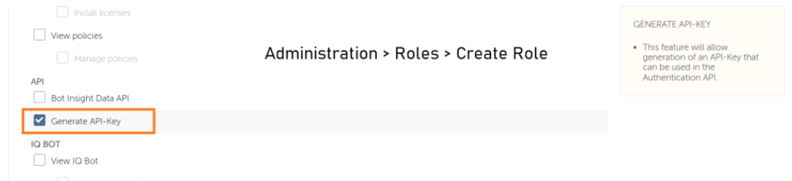
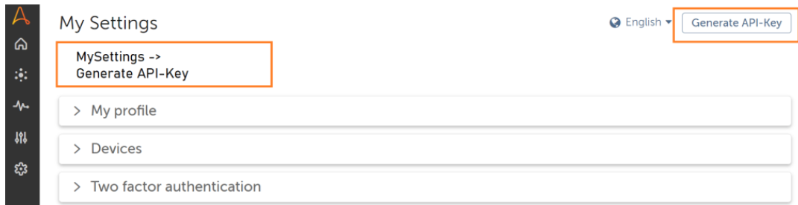
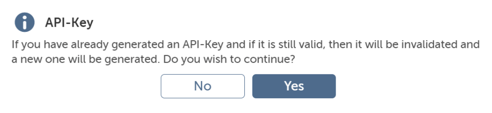
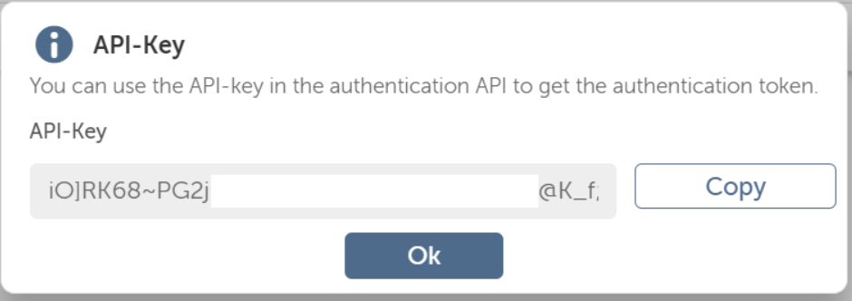
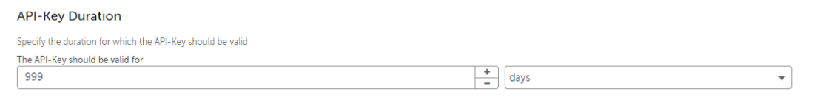

# Lab: Automation Anywhere Copilot for Automators

#### Introduction

In this lab, we will be demonstrating the use of `Generate API-Key to access APIs` in A360.

Automation Anywhere version has added a new feature is supported with the Control Room for accessing APIs. This is by default not enabled for any of the **System-created** roles & needs a **custom role** to be created to assign this feature.

**IMPORTANT:** This lab can only be done with Enterprise Automation Anywhere edition. API task feature is not available in Commmunity edition.

#### How to Generate API-Key to access APIs in A360?

We have divided the process of generating the API-Key in A360 into a two-step process.

#### Step 1: Assigning Generate API-Key role:

- Log in to the Control Room as an **Admin** user.
- Navigate to the **Administration > Roles** section & Create a new Role.
- Provide a custom name for the new role being created.
- Scroll down to the API section & select the **Generate API-Key** option under API.
- Assign the users available to assign this role to Generate the API-Key.
- Click on **Create Role** to Save the created Role.

#### Step 2: Generate an API-Key:

- Log in to the Control Room with the **user’s credentials** having the above-created role assigned.
- Once logged in, click on the username in the left pane bottom of the Control Room and click on **MySettings**.
- Click on the **Generate API-Key** to generate the Key

- If you already generated an API-Key then there would be a popup asking to regenerate it. Once you click on Yes, the existing API-Key and its references would be invalidated and a new API-Key would be generated. You would need to update the new API-Key in all your existing references.

- You can use the API-Key in the authentication API to get the authentication token.

####  Configuring API-Key Duration in A360
You can configure the duration for the API-Key generated using the above steps. The steps to configure the API-Key duration are:

1. Log in to the control room with an **Admin** user.
2. Navigate to **Administration > Settings > Security Settings** and update the **API-Key Duration** setting.

