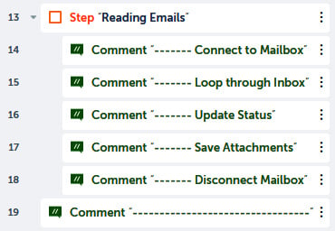

Lab: Working with Emails 
==========================

This lab will explore automating tasks that use **email**. We will
be looking at the **Email** package in Automation Anywhere. We will look
at how to connect to different types of email accounts, such as
**Exchange Web Services (EWS)**, IMAP, and POP3. You will also learn
about sending and receiving emails, as well as looping through different
email folders. The walk-throughs will include working with attachments.
This lab will also introduce the `Dictionary` variable
type. A `Dictionary` variable type is used to store key-value
pairs. Each item in the dictionary has a key and a value. The key is
used as a mapping reference to the value. A system dictionary already
exists for using emails in Automation Anywhere. We will learn how to use
this system dictionary variable type.

In this lab, we will cover the following:

-   Connecting to mailboxes
-   Reading emails and attachments
-   Sending emails and attachments

Technical requirements 
======================

In order to install Automation Anywhere Bot agent, the following
requirements are necessary:

-   Google Chrome
-   Completed registration with Automation Anywhere  Community
    Edition
-   Successful log-on to Automation Anywhere  Community Edition
-   A successfully registered local device
-   Successfully downloaded sample data from GitHub

Downloading sample data from GitHub 
===================================

Download the whole file structure to your root
folder. I use my `C:\` drive as my root folder. The course will
be referring to this folder to help identify the location of files that
will be needed. You do not need a GitHub account to download the
repository.

To download the complete repository needed for this course, perform the
following steps:

1.  Navigate to the GitHub repository from your web browser using the
    following link:
    <https://github.com/fenago/automation-anywhere-next-level>:

2.  To download, click on the green **Clone or download** button. This
    will open a small dialog box, and then click on **Download ZIP**:

3.  This will begin the downloading of the compressed
    `automation-anywhere-next-level.zip` file.

4.  Once the ZIP file has been downloaded, extract it all and copy `automation-anywhere-next-level/Hands-On-RPA-with-AA-Sample-Data` folder into `C:\` drive:

5.  Close the GitHub page.

Connecting to mailboxes 
=======================

In the first walk-through, you will learn how to create a new session by
connecting to the following:

-   An Outlook mailbox
-   An POP3/IMAP mailbox
-   An EWS mailbox

The practical approach for this lab will be to demonstrate the
different actions from the **Email** package. We will be using comments
and steps to help structure all the actions. As the first section will
look at how we can connect to different types of mailboxes, we can begin
by building the initial skeleton using comments and steps.

Let\'s start this walk-through by executing the following steps:

1.  Log in to **Control Room**.
2.  Create a new bot in the `\Bot\` folder and call it
    `Lab 13 – Email Automation`.
3.  Add a new **Comment** action on line **1** as
    `"---------------------"` and click on **Save**.
4.  Add a **Step** just below line **1**, set the **Title** property as
    `"Connecting to mailboxes"`, and click on **Save**.
5.  Add another **Step** just below line **2**, ensuring it is within
    the previous **Step** on line **2**, set the **Title** property as
    `"Connecting to Outlook"`, and click on **Save**.
6.  Add another **Step** just below line **3**, ensuring it is aligned
    to the **Step** on line **3**, set the **Title** property as
    `"Connecting to POP3/IMAP"`, and click on **Save**.
7.  Add another **Step** just below line **4**,
    ensuring it is aligned to the **Step** on line **4**, set the
    **Title** property as `"Connecting to EWS"`, and click on
    **Save**.
8.  Add a new **Comment** action on line **6** as
    `"---------------------"` and click on **Save**. Your
    initial development interface should look like this:

That\'s great, we now have a structure for our walk-through. The first
connection we will look at is Microsoft Outlook.

Connecting to Outlook 
---------------------

Outlook already has your mailbox configured,
whether it is POP3, IMAP, Gmail, or Exchange. Because of this, no
details or credentials are needed. Something to remember is that
Automation Anywhere does not support multiple mailboxes on Outlook. If
you do have more than one mailbox connected to Outlook, your bot will
use the default mailbox.

Let\'s start this walk-through by executing the following steps:

1.  Expand the **Step** on line **3** titled
    `"Connecting to Outlook"`.

2.  To create an Outlook session, add the **Email: Connect** action just
    below line **3**, ensuring it is within the **Step** on line **3**.

3.  Set the following properties for the **Email: Connect** action on
    line **4**:

    **Session name**: `EmailOutlook`

    **Connect to**: **Outlook**

    The properties should look like this:

    
    
    

4.  Click on **Save**.

5.  The session is now created. Once you have finished, you will need to
    disconnect from the mailbox. To do this, add the **Email:
    Disconnect** action just below line **4**, ensuring it is within the
    step on line **3**.

6.  Set the following property for the **Email: Disconnect** action on
    line **5**:

    **Session name**: `EmailOutlook`

    The property should look like this:

    
    
    

7.  Click on **Save** and your development interface for this section
    should look like this:

That\'s all there is to it; once a session has been established, the bot
can start working with the mailbox. This could be tasks such as reading,
searching, and moving emails. In the next section, we
will look at how to establish a connection with a
POP3 and IMAP mailbox to create a session.

Connecting to a POP3/IMAP mailbox 
---------------------------------

When connecting to a POP3 or IMAP mailbox, you
will need the mailbox and credential details. This information would be
needed whenever you want to connect to your mailbox using any email
application. The following information is needed to establish a
connection and read emails:

-   Incoming mail server name
-   Whether SSL is required
-   Port number
-   Email address/username
-   Password

To give an example of this information, if you were connecting to a
Gmail account, the details would be as shown in the following figure:

For our walk-through, we will be connecting to a Gmail account using
IMAP, but you can use any mailbox as long as you have the required
information.

Connecting to a Gmail account using IMAP

When connecting to a Gmail account using IMAP, you will need to ensure
that the session secure app access is set to *on*. If it is set as
*off*, Automation Anywhere will not be able to connect to your Gmail
account. This setting is not required when connecting using POP.

Further details on how to configure this setting can be found at
<https://support.google.com/accounts/answer/6010255?hl=en>.

We will enter our email address/password as an insecure string, in this
case, but alternatively, you can use a variable.

Let\'s start this walk-through by executing the
following steps:

1.  Expand the step on line **6** titled
    `"Connecting to POP3/IMAP"`.

2.  To create the **IMAP** session, add the **Email: Connect** action
    just below line **6**, ensuring it is within the step on line **6**.

3.  Set the following properties for the **Email: Connect** action on
    line **7**:

    **Session name**: `EmailSession`

    **Connect to**: **Email server**

    **Host**: `imap.gmail.com`

    **Port**: `993`

    **Username**: **Insecure string** -- `******@gmail.com`
    (*enter your email address*)

    **Password**: **Insecure string** -- `*********` (*enter
    your email password*)

    **Use secure connection(SSL/TLS)**: *Checked*

    **Protocol**: **IMAP** (*Select POP3 for a POP3 mailbox connection*)

    The properties should look like this:

    
    
    

4.  Click on **Save**.

5.  To disconnect from the mailbox, just add the **Email: Disconnect**
    action below line **7**, ensuring it is aligned to the action on
    line **7**.

6.  Set the following property for the **Email: Disconnect** action on
    line **5**:

    **Session name**: `EmailSession`

    The property should look like this:

    
    
    

7.  Click on **Save**. Your development interface for this section
    should look like this:

That\'s another connection established. You should now be comfortable
with connecting to mailboxes using the POP3 or IMAP protocol. Another
popular type of mailbox is **Exchange Server**. We will learn how to
connect to an Exchange mailbox in the next section.

Connecting to an EWS mailbox 
----------------------------

When connecting to an Exchange mail server, only a
few pieces of information are needed. The following information would be
required whenever you want to connect to your mailbox using any email
application to read emails:

-   Username or email address
-   Password
-   Domain name (optional)
-   Exchange server version

To give an example of this information, if you were connecting to an
Outlook Exchange account, the details would be as shown in the following
figure:

For our walk-through, we will be connecting to an Outlook Exchange
Server account, but you can use any Exchange mailbox as long as you have
the required information. As we did in the *Connecting to a POP3/IMAP
mailbox* section previously, we will enter the email address/password as
an insecure string.

Let\'s start this walk-through by executing the following steps:

1.  Expand the **Step** on line **9** titled
    `"Connecting to EWS"`.

2.  To create the Exchange session, add the **Email: Connect** action
    just below line **9**, ensuring it is within the step on line **9**.

3.  Set the following properties for the **Email: Connect** action on
    line **10**:

    **Session name**: `EmailSessionEWS`

    **Connect to**: **EWS server**

    **Username**: **Insecure string** -- `******@outlook.com`
    (*enter your email address*)

    **Password**: **Insecure string** -- `*********` (*enter
    your email password*)

    **Enter Domain name (optional)**: `outlook.com`

    **Exchange Version**: **Exchange2010**

    The properties should look like this:

    

4.  Click on **Save**.

5.  To disconnect from the mailbox, just add the **Email: Disconnect**
    action below line **10**, ensuring it is aligned to the action on
    line **10**.

6.  Set the following property for the **Email: Disconnect** action on
    line **11**:

    **Session name**: `EmailSessionEWS`

    The property should look like this:

    
    
    

7.  Click on **Save** and your development interface for this section
    should look like this:

Great job! In this section, you\'ve learned how to connect to the
different types of mailboxes. The complete development interface for all
the mailbox connections should look like this:

If you run the bot, it will look as if it hasn\'t
done much, but your bot has connected to each mailbox and disconnected.
As long as the mailbox and the credentials are correct, the bot will
complete the task without raising any errors.

Before we move on to the next section, let\'s ensure that our bot is
neat and tidy. You can collapse the step on line **2** and then disable
this step by clicking on the three dots on line **2** and selecting
**Disable action**. As you are disabling the step, all the actions and
the sub-steps within this step will be disabled:

Our bot is now nice and tidy and we are ready to
move on to the next section. In the next section, we will learn how to
read emails from your mailbox and save attachments.

Reading emails and attachments 
==============================

Once connected to our
mailbox, we want our bot to process emails in one
form or another. More than likely, our manual task would involve working
with specific emails, such as emails sent from a particular sender. It
could also include saving any attachments from our emails. In this
section, you will learn how to create a loop to iterate through the
inbox and only read unread emails from a specific sender. The bot will
then change the email status to read and save any attachments.

You will also be introduced to the `Dictionary` type variable;
Automation Anywhere already has a pre-built dictionary for emails. A
`Dictionary` type variable stores a value for a given key
value. Together, these are known as a **key-value
pair**. For each email that your bot reads, the `Dictionary`
variable will store the following information:

For this walk-through, we will use Outlook as our mailbox. You can,
however, apply a different type of connection if
you wish. As we have disabled the previous actions from our bot, we
can continue using the same task bot. Before we
add any actions for the bot to perform, we will
begin by building the skeleton structure with comments and steps. You
will build a bot that performs the following tasks:

1.  Loops through emails in the inbox
2.  Applies filters and specifies folders
3.  Updates email status
4.  Saves attachments

Let\'s start this walk-through by executing the following steps:

1.  Add a step just below line **12**, set the **Title** property as
    `"Reading Emails"`, and click on **Save**.
2.  Add a new **Comment** action as
    `"------- Connect to Mailbox"` on line **14**, ensuring it
    is within the **Step** on line **13**, and click on **Save**.
3.  Add a new **Comment** action as
    `"------- Loop through Inbox"` on line **15**, ensuring it
    is within the **Step** on line **13**, and click on **Save**.
4.  Add a new **Comment** action as `"------- Update Status"`
    on line **16**, ensuring it is within the **Step** on line **13**,
    and click on **Save**.
5.  Add a new **Comment** action as
    `"------- Save Attachments"` on line **17**, ensuring it
    is within the **Step** on line **13**, and click on **Save**.
6.  Add a new **Comment** action as
    `"------- Disconnect Mailbox"` on line **18**, ensuring it
    is within the **Step** on line **13**, and click on **Save**.
7.  Add a new **Comment** action as
    `"---------------------------------"` on line **19** and
    click on **Save**. Your initial
    development interface should look like this:

That\'s great! We now have a structure for our walk-through. As we did
in the previous section, *Connecting to mailboxes*, we will begin by
creating our connection to Outlook:

1.  To create the Outlook session, add the **Email: Connect** action
    just below line **14**, ensuring it is within the step on line
    **13**.

2.  Set the following properties for the **Email: Connect** action on
    line **15**:

    **Session name**: `EmailSession`

    **Connect to**: **Outlook**

    The properties should look like this:

    
    
    

3.  Click on **Save**.

4.  Let\'s also add the
    disconnect action by adding **Email:
    Disconnect** just below line **19**, ensuring it is aligned to the
    **Comment** action on line **19**.

5.  Set the following property for the **Email: Disconnect** action on
    line **20**:

    **Session name**: `EmailSession`

    The property should look like this:

    
    
    

6.  Click on **Save** and your development
    interface for this section should
    look like the following:

We have now established the connection to the mailbox. In the next
section, you will learn how to add a **Loop** action so that the bot can
read email messages from the inbox.

Looping through emails from a folder 
------------------------------------

Once we have the loop in place, we will need a
variable to store details of each individual
email. For an email message, we will use the `Dictionary`
variable type. Follow the given walk-through to guide you on how to
build the loop and store each email:

1.  For our `Dictionary` variable type, create a new variable
    called `dctEmail` and set **Type** to **Dictionary** and
    **Subtype** to **String**, as follows:

    
    
    

2.  To add our loop to read all emails, drag the **Loop** action just
    below line **16**, ensuring it is aligned to the **Comment** action
    on line **16**.

3.  Set the following properties for the **Loop** action on line **17**:

    **Loop Type**: **Iterator**

    **Iterator**: **For each mail in mail box**

    **Session name**: `EmailSession`

    **Type of email to get**: **ALL**

    **Message format**: **PLAINTEXT**

    **Assign the current value to variable**: **dctEmail -- Dictionary
    of Strings**

    The properties should
    look like this:

    
    
    

4.  Click on **Save**.

That\'s great! You have learned how to add a
**Loop** action so that your bot can read each
email from your mailbox. In the next section, you will learn how to add
filters and specify folders to read.

Applying filters and specifying folders 
---------------------------------------

The bot will read all emails from the connected
mailbox, but to perform specific tasks, we often
need to work with specific emails. To allow our bot to only look for
emails that meet certain criteria, we can apply filters within our loop.
These filters include the following:

-   Specifying the email status
-   Specifying the mailbox folders
-   Specifying the email subject line text
-   Specifying the email sender
-   Specifying the date and time of the received email

For this walk-through, we want our bot to only look for emails in the
inbox that are unread. To configure our bot to only loop through these
specific emails, execute the following steps:

1.  Update the loop properties for the **Loop** action on line **17**:

    **Type of email to get**: **UNREAD**

    **From a specific folder (optional)**: `Inbox`

    The properties should look like this:

    
    
    

2.  Click on **Save**.

As you can see, all the filters are configured on
the **Loop** action. In the following subsections,
we will outline all the other filters that can be applied.

### Specifying the email status

You have just updated the email status filter, but
you can see, as per the following screenshot, that
you have an option to select either **ALL**, **READ**, or **UNREAD**
emails only:

### Specifying the mailbox folders

You can set a specific folder here. Wildcard
characters can also be used as part of the folder name. Nested
subfolders can be specified using the `Inbox/SubFolder1`
format. If needed, variables can also be used to enter this value. The
following screenshot shows how to set `Inbox` as the specified
folder:

### Specifying the email subject line text

To set a particular text in the subject line, you
can do so here. If needed, **String** type
variables can also be used to enter this value:

### Specifying the email sender

Here, you can look at emails from a specific
sender. Enter the sender\'s email address (you can also enter multiple
email addresses separated by a semicolon). If needed, `String`
type variables can also be used to enter this value:

### Specifying the date and time of the received email

You can also set a date/time filter. Again,
variables can be used here, but they need to be of the
`Datetime` type:

Hopefully, this has given you an overview of how you would configure
your bot to apply the different types of filters to your **Loop**
action. As we continue with our walk-through, we have already added our
loop. All our actions for each email need to be moved to within our
loop.

Let\'s continue with our bot by moving our comments so that they are
inside our loop:

1.  Drag the **Comment** actions to lines **18** and **19** so that they
    are within the loop on line **17**.
2.  Click on **Save** and your development window should be looking like
    this:

All looking good so far; the bot will now loop
through all unread emails in the inbox. In the next section, we will
look at how to update the email status.

Updating the email status 
-------------------------

As our bot will only be processing unread emails,
we do not want it to duplicate the process
multiple times for the same email. If we update the email status to
**READ**, it will ensure that the same email is not picked up by the bot
again.

Let\'s start this walk-through by executing the following steps:

1.  To update the status, add the **Email: Change status** action just
    below line **18**, ensuring it is aligned to the **Comment** action
    on line **18**.

2.  Set the following properties for the **Email: Change status** action
    on line **19**:

    **Session name**: `EmailSession`

    **Change status to**: `Read`

    The properties should look like this:

    
    
    

3.  Click on **Save**.

Great progress! Your bot will now update the
status of each unread email to read, ensuring any
processing is not duplicated. Quite often, we work with attachments in
our emails. In the next section, you will learn how to save email
attachments.

Saving attachments 
------------------

When automating tasks that involve email, we tend
to perform tasks with attached documents. We will
continue with our walk-through and further build the bot. Here, you will
learn about managing attached documents. We will instruct our bot to
save any attachments to a specific folder.

To ensure the bot is robust, we will check whether the target folder
exists and create it if it doesn\'t. We will configure our bot to save
any attachments to the folder at
`C:\Hands-On-RPA-with-AA-Sample-Data\Chapter13_Emails`.

Let\'s start this walk-through by executing the following steps:

1.  To check whether our target folder exists, add the **If** action
    just below line **20**, ensuring it is aligned to the **Comment**
    action on line **20**.

2.  Set the following
    properties for the **If** action on line
    **21**:

    **Condition**: **Folder does not exist**

    **Folder path**:
    `C:\Hands-On-RPA-with-AA-Sample-Data\Chapter13_Emails`

    **How long you would like to wait for this condition to be
    true?(Seconds)**: `0`

    The properties should look like this:

    
    
    

3.  Click on **Save**.

4.  To create the folder if it doesn\'t exist, add
    the **Folder: Create** action just below line
    **21**, ensuring it is within the **If** action on line **21**.

5.  Set the following properties for the **Folder: Create** action on
    line **22**:

    **Folder**:
    `C:\Hands-On-RPA-with-AA-Sample-Data\Chapter13_Emails`

    **Overwrite an existing folder**: *Unchecked*

    The properties should look like this:

    
    
    

6.  Click on **Save**.

7.  We are now ready to add the action to save any
    email attachments. Add the **Email: Save
    attachments** action just below line **22**, ensuring it is within
    the **Loop** action on line **17** but not within the **If**
    condition on line **21**. We will set the **Overwrite files**
    property to `True`, as we may test the bot multiple times
    and we do not want it to fail while trying to save an attachment
    that already exists.

8.  Set the following properties for the **Email: Save attachments**
    action on line **23**:

    **Save attachments to folder**:
    `C:\Hands-On-RPA-with-AA-Sample-Data\Chapter13_Emails`

    **Overwrite file(s)**: *Checked*

    The properties should look like this:

    
    
    

9.  Click on **Save**.

10. Just one final action left. Let\'s add a message box so that we can
    see the contents of each email the bot reads.
    For this, we will use the
    `Dictionary` variable we created. Add the **Message box**
    action just below line **23**, ensuring it is within the **Loop**
    action on line **17** but not within the **If** condition on line
    **21**.

11. Set the following properties for the **Message box** action on line
    **24**:

    **Enter the message box window title**: `Reading Emails`

    **Enter the message to display**:

    `subject: |$dctEmail{emailSubject}$|`

    `From: |$dctEmail{emailFrom}$|`

    `Message: |$dctEmail{emailMessage}$|`

    **Scrollbar after lines**: `30`

    **Close message box after**: *Checked*

    **Seconds**: `5`

    The properties should look like this:

    
    
    

12. Click on **Save**. The development
    window for the **Reading Emails** section
    should look like this:

You can send yourself some
emails and test your bot. Ensure you have the correct incoming server
details if you are not using Outlook. The bot will read the new emails,
save all attachments, and update the status. Good work. We will next
look at sending emails.

Sending emails and attachments 
==============================

We have looked at connecting with incoming
mail servers to read emails.
We will now move on to the next section, where we will be exploring how
to send emails. Emails are always sent in one of the following three
ways -- either a simple independent email, a forwarded message, or a
reply. For all three, you will need to know the outgoing mailbox
details. As it is the same with reading emails, you can send an email
via Outlook, POP3/IMAP, or Exchange. The information needed for the
outgoing server is as follows:

-   Outgoing mail server name
-   Whether SSL/TLS/authentication is required
-   SSL/TLS port number
-   Email address/username
-   Password

To give an example of this information, if you were connecting to a
Gmail account, the outgoing server IMAP details would be as shown in the
following figure:

For our walk-through, we will be demonstrating how to perform the
following actions:

-   Sending an email
-   Forwarding an email
-   Replying to an email

When forwarding or replying to an email, a source email is needed. For
instance, you need an initial email in order to reply to it and you need
an initial email in order to forward it. This is why both the **Reply**
and **Forward** actions need to be performed within an email session.
This ensures they have a source email to work with. When just sending an
email by itself, a session is not needed as it\'s not dependent on a
source email.

For this walk-through, we will demonstrate all three methods of sending
an email. As always, we will start by
creating the skeleton using comments and steps.

Let\'s start this walk-through by executing the
following steps:

1.  Add a step just below line **27**, set the **Title** property as
    \"`Sending Emails"`, and click on **Save**.
2.  Add a new **Comment** action as
    `"------- Sending an Email"` on line **29**, ensuring it
    is within the **Step** on line **28**, and click on **Save**.
3.  Add a new **Comment** action as
    `"------- Forwarding an Email"` on line **30**, ensuring
    it is within the **Step** on line **28**, and click on **Save**.
4.  Add a new **Comment** action as
    `"------- Replying to an Email"` on line **31**, ensuring
    it is within the **Step** on line **28**, and click on **Save**.
5.  Add a new **Comment** action as `"---------------------"`
    on line **32**, and click on **Save**. Your development interface
    should look as in the following screenshot:

That\'s good, we now have a structure for our demonstration. In the next
section, we will start by looking at sending a
simple email and then one
that includes an attached document.

Sending an email 
----------------

For this walk-through, we
will use a Gmail account to send our email. We
know what the SMTP outgoing server settings need to be for this. You
will need to know your email account credentials for testing.

Connecting to a Gmail account using IMAP

When connecting to a Gmail account using IMAP, you will need to ensure
that the less secure app access is set to *on*. If it is set as *off*,
Automation Anywhere will not be able to connect to your Gmail account.
This setting is not required when connecting using POP.

Further details on how to configure this setting can be found at
<https://support.google.com/accounts/answer/6010255?hl=en>.

Let\'s begin by executing the following steps:

1.  To send our email, add the **Email: Send** action just below line
    **29**, ensuring it is within the step on line **28**.

2.  There are a number of properties to set for the **Email: Send**
    action. Starting with the recipient and subject details, set the
    following properties for the **Email: Send** action on line **30**:

    **To address**: `******@gmail.com` (*the email address you
    are sending to*)

    **Subject**: `RPA – Sending Emails`

    These property settings should look like this:

    
    
    

3.  Continue with
    configuring the **Email: Send** action on line
    **30** by adding the following settings to configure the message
    contents:

    **Send email as**: **Plain text**

    **Message**: `This is message sent from your RPA Bot`

    These property settings should look like this:

    
    
    

4.  Finally, to configure the outgoing server
    connection details, add the following settings
    for the **Email: Send** action on line **30**:

    **Send email via**: **Email server**

    **From address**: `******@gmail.com` (*email address you
    are sending from*)

    **Email server host**: `smtp.gmail.com`

    **Email server port**: `587`

    **Use secure connection (SSL/TLS)**: **True**

    **My server requires authentication**: **True**

    **Username (optional)**: **Insecure string** --
    `******@gmail.com` (*enter your email address*)

    **Password (optional)**: **Insecure string** --
    `*********` (*enter your email password*)

    These properties should look like this:

    
    
    

5.  Click on **Save**.

All set to send an email, great work! As long as
you have the correct mail server settings, it
should all be good to go. We will continue by adding an attachment to
this email in the following section.

### Attaching a document to an email

Here, we will further build on our bot and add an
attachment to our email. This is all done within
the **Email: Send** action. Follow the given steps to add a document to
the email:

1.  To add an attachment, update the following property for the **Email:
    Send** action on line **30**:

    **Attachment (optional)**: **Desktop file** --
    `C:\Hands-On-RPA-with-AA-Sample-Data\Chapter05_InputData.csv`

    The property should look like this:

    
    
    

2.  Click on **Save**.

Your bot can now send an email. To do this, you don\'t need an email
session; all the required information is contained within the **Email:
Send** action. In the next section, we will look at forwarding an email.

Forwarding an email 
-------------------

You can only perform an **Email: Forward** action
from within an email session and loop. There needs
to be a source email that you are actually forwarding, but apart from
that, all that\'s needed is the forwarding email address, a message
(optional), and your outgoing server mailbox details.

In this example, we will use Outlook as our outgoing mailbox. Let\'s
assume you have already built your email session and loop to read your
emails from your incoming mailbox. To configure your bot to forward an
email, just follow these steps:

1.  Add the **Email: Forward** action just below line **31**, ensuring
    it is within the step on line **28**.

2.  Set the following properties for the **Email:
    Forward** action on line **32**:

    **To address**: `******@gmail.com` (*the email address you
    are forwarding the message to*)

    **Send email as**: **Plain text**

    **Message (optional)**:
    `This email is forwarded by your RPA Bot`

    **Send email via**: **Outlook**

    The properties should look like this:

    
    
    

3.  Click on **Save**.

It\'s as simple as that; attachments can be added in the same way as you
would when sending a standard email. Only one more
type of email sending to go -- that is, replying
to an email, which we will look at next.

Replying to an email 
--------------------

Just like forwarding an email, you can only
perform an **Email: Reply** action from within an
email session and loop. In this example, we will again use Outlook as
our outgoing mailbox and once again assume you have already built your
email session and loop to read your emails from your incoming mailbox.
To configure your bot to reply to an email, just follow the given steps:

1.  Add the **Email: Reply** action just below line **33**, ensuring it
    is within the step on line **28**.

2.  Set the following properties for the **Email: Reply** action on line
    **34**:

    **Send email as**: **Plain text**

    **Message (optional)**:
    `This email is a reply by your RPA Bot`

    **Send email via**: **Outlook**

    The properties should look like this:

    
    
    

3.  Click on **Save**. The development window for
    the **Reading Emails** section should look
    like this:

You have done absolutely great! All three types of outgoing emails are
completed. Again, attaching files works the same
in all three. Your bot is ready for any
email-related automation you need.

Summary 
=======

This lab has been about everything related to email. The
walk-throughs have demonstrated how to connect to the different types of
mail servers, as well as using Outlook. You learned how to read from any
email folder using specified criteria, such as a certain sender or a
particular value in the subject line. You further built your knowledge
of learning how to send emails, including replying and forwarding
emails. That\'s not all; we also included how to save and add
attachments to our emails.

In the next lab, we will move on to using automation with PDF files.
PDF files are very popular and are commonly used. There are many uses --
one being invoices. You will learn how to use a bot to read PDF files,
including extracting text and images. You will also learn how to split
and merge documents and decrypt and encrypt PDF files.
