Lab 7: Working with Databases 
=============================


In this lab, we will be using the following packages:


This lab will consist of demonstrating the
different actions within the **Database** package. We will be using some
files from the GitHub repository, which is part of the technical
requirements. A sample each of the Access and SQLite databases are
included in the GitHub repository and both are used as part of the
lab. It is assumed that you already have a basic understanding
of databases and SQL statements. You will learn how to configure an RPA
bot to execute these statements.

In this lab, we will cover the following topics:

-   Connecting to, and disconnecting from, databases
-   Reading data from databases
-   Updating databases


Technical requirements 
======================


In order to install Automation Anywhere, the following are required:

-   Google Chrome 
-   Completed registration with Automation Anywhere  Community
    Edition
-   Successful logon to Automation Anywhere  Community Edition
-   Successful registration of a local device
-   The successful downloading of sample data from GitHub


Connecting to, and disconnecting from, databases 
================================================

In this lab, you will learn how to do
the following:

-   Connect to a SQLite database
-   Connect to an Access database

As we have done previously, we will be using comments and steps to help
structure all the actions. We will begin by building the initial
skeleton using comments and steps:

Let\'s start this lab by performing the following steps:

1.  Log in to **Control Room**.
2.  Create a new bot and call it
    `Lab7 – Database Automation` in the `\Bot\`
    folder.
3.  Add a new **Comment** action as `"---------------------"`
    and click on **Save**.
4.  Add a **Step**, set the **Title** property as
    \"`Connecting to Databases"`, and then click on **Save**.
6.  Add another **Step**, set the **Title** property as
    \"`Connecting to a SQLite Database"`, and then click on
    **Save**.
7.  Add another **Step**, set the **Title** property as
    \"`Connecting to MS Access"`, and then click on **Save**.


Connecting to a SQLite database 
-------------------------------

The following lab will
show how to connect to a SQLite database. A sample database called
`Chapter15_SQLite.db` is available as part of the GitHub
repository.

Let\'s start this lab by performing the following steps:

1.  To create the SQLite database session, drag the **Database:
    Connect** action. You are now ready to start setting the
    properties.

2.  Firstly, we need to specify the session
    details. To do this, set the following properties for the
    **Database: Connect** action:

    **Session name**: `db_SqLite`

    **Connection mode**: **User defined**

    The properties should look like the following screenshot:

    
    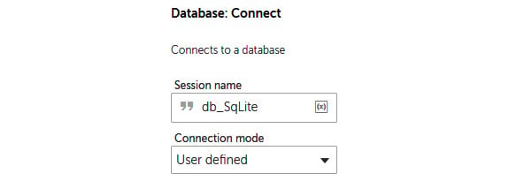
    
3.  Click on **Save**.

4.  The next part is to specify the type of database and location of the
    file. To do this, set the following properties for the **Database: Connect** action:

    **Database type**: **SqLite**

    **Database file path**: **Desktop file** --
    `C:\Hands-On-RPA-with-AA-Sample-Data\Chapter15_SQLite.db`

    The properties should look like the following screenshot:

    
    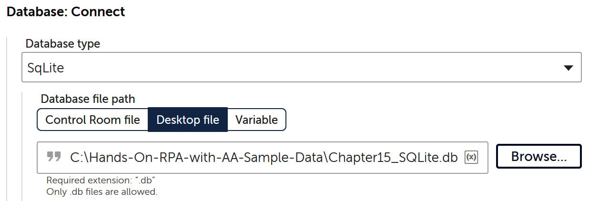
    


5.  Click on **Save**.

6.  The SQLite database session is now created. To disconnect, add the
    **Database: Disconnect** action , ensuring it
    is aligned to the **Database: Connect** action .

7.  Set the following property for the **Database: Disconnect** action:

    **Session name**: `db_SqLite`

    The property should look like the following screenshot:

    
    
    


8.  Click on **Save**. Your development interface
    for this section should look like the following screenshot:


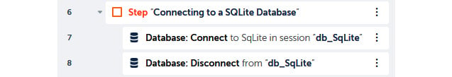


All done! You can run the bot to test it. It won\'t actually do anything
visible, but we know it establishes a connection with our SQLite
database and then disconnects.

Later in this lab, you will learn how to read data after creating a
session. Continuing with connecting with databases, we move on to Access
databases in the next section.


Connecting to an Access database 
--------------------------------

Microsoft Access is part of the Microsoft Office
suite and is a very popular database platform. A sample database,
`Chapter15_Access.accdb`, is included in the GitHub
repository. We will be connecting to this for the following
lab.

Let\'s start this lab by performing the following steps:

1.  To create the Access database session, drag the **Database:
    Connect** action , ensuring it is within the
    **Step** . You are now ready to start setting the
    properties.

2.  We first need to specify the session details. To do this, set the
    following properties for the **Database: Connect** action on line
    **10**:

    **Session name**: `db_Access`

    **Connection mode**: **User defined**
    The properties should look like the following
    screenshot:

    
    
    


3.  Click on **Save**.

4.  The next part is to specify the type of database and the location of
    the file. To do this, set the following properties for the
    **Database: Connect** action:

    **Database type**: **Microsoft Access**

    **Database file path**: **Desktop file** --
    `C:\Hands-On-RPA-with-AA-Sample-Data\Chapter15_Access.accdb`

    The properties should look like the following screenshot:

    
    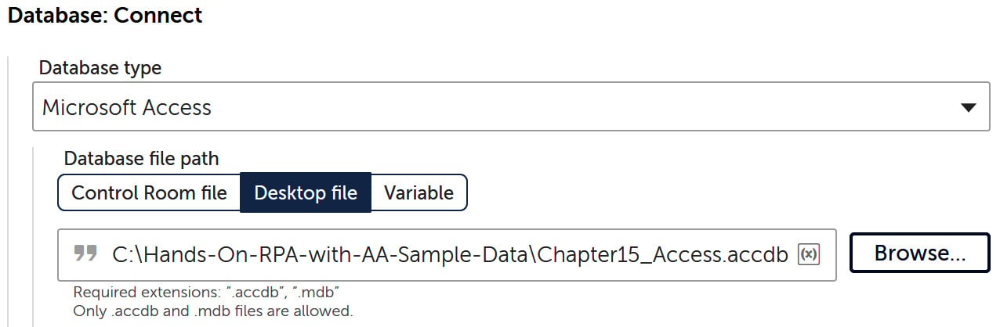
    


5.  Click on **Save**.

6.  We now have to add the **Database: Disconnect** action. To do this,
    add the **Database: Disconnect** action,
    ensuring it is aligned to the **Database: Connect** action on line
    **10**.

7.  Set the following property for the **Database: Disconnect** action:

    **Session name**: `db_Access`

    The property should look like the following screenshot:

    
    
    


8.  Click on **Save**. Your development interface for this section
    should look like the following screenshot:


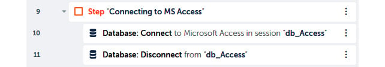


Now you know how easily a database connection can
be established to a Microsoft Access database.

In the next section, you will learn how to read data from databases.


Reading data from databases 
===========================


Naturally, the next stage is to access the data
from our database. In this section, you will learn how to execute a SQL
`Select` statement to retrieve data. A `Select`
statement is commonly used among most databases.

Before we move on to the next section, let\'s disable our actions from
the previous section. To do this, just click on the three dots on line
**2**, select the **Disable** action, and then click on **Save**. This
is designed to ensure that it doesn\'t interfere as we proceed with
reading the data.

To read data, we will need to create a `Record` type variable
to store each record. In the following lab, you will run an
aggregated `Select` statement against the sample Microsoft
Access database in the GitHub repository. This Access database has a
table called `tblSales`, and the structure of the table is
shown in the following screenshot:


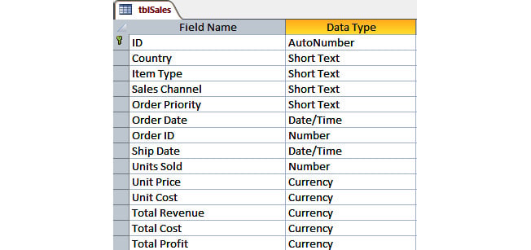


For this lab, we will configure our bot
to do the following:

-   `Group by` the `Item Type` field
-   `Count` the total `Item Type` records for each
    group
-   `Sum` the `Units Sold` values for each group
-   `Sum` the `Total Profit` values for each group

To achieve this, we will run the following SQL statement:


```
SELECT [Item Type] As Type, Count([Item Type]) as Orders, Sum([Units Sold]) as Quantity, Sum([Total Profit]) as Profit FROM tblSales GROUP BY [Item Type] ORDER BY [Item Type]
```


The bot will run the statement and retrieve the results in a CSV file as
well as displaying a **Message box** for each record returned.

Let\'s start this lab by performing the following steps:

1.  To keep our bot organized, let\'s begin by adding a new **Step**
    and setting the **Title** property to
    **Reading from Databases**.

2.  Keeping up with tidy scene, it would make sense to collapse the
    **Step** . Your development interface should look like
    the following screenshot:

    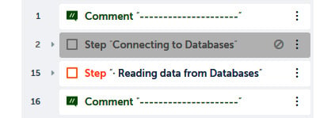
    

3.  Click on **Save**.

4.  As we will be reading records, we will need a
    `Record` type variable. Create a `Record` type
    variable and call it `recData`.

5.  We are now ready to create our connection. Drag the **Database:
    Connect** action , ensuring it is within the
    **Step** .

6.  To create our connection, set the following properties for the
    **Database: Connect** action:

    **Session name**: `db_Access`

    **Connection mode**: **User defined**

    **Database type**: **Microsoft Access**

    **Database file path**: **Desktop file** --
    `C:\Hands-On-RPA-with-AA-Sample-Data\Chapter15_Access.accdb`

    The properties should look like the following screenshot:

    
    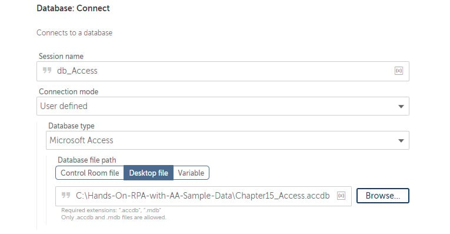
    


7.  Click on **Save**.

8.  Next, we add the action to read the data using
    the SQL statement and send the results to a CSV file. To do this,
    add the **Database: Read** action , ensuring
    it is aligned to the **Database: Connect** action .

9.  Set the following properties for the **Database: Read** action:

    **Session name**: `db_Access`

    **Enter SELECT Statement**:
    `SELECT [Item Type] As Type, Count([Item Type]) as Orders, Sum([Units Sold]) as Quantity, Sum([Total Profit]) as Profit FROM tblSales GROUP BY [Item Type] ORDER BY [Item Type]`

    **Export data to CSV**: **Desktop file** --
    `C:\Hands-On-RPA-with-AA-Sample-Data\Chapter15_Sales.csv`

    **Export data with header**: *Checked*

    **When saving**: **Overwrite existing file**

    The properties should look like the following
    screenshot:

    
    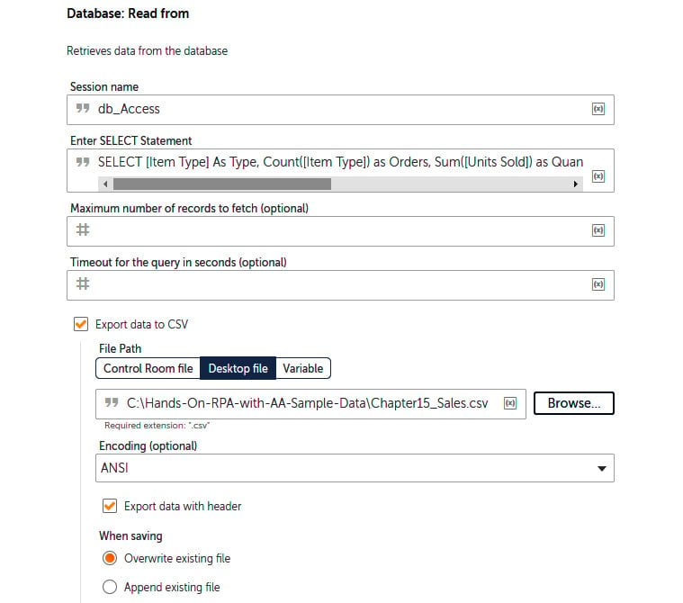
    


10. Click on **Save**.

11. At this point, the bot would have retrieved the full dataset from
    the SQL statement. As we want to see the data for each record, we
    will add a loop to iterate through our dataset. To do this, drag the
    **Loop** action , ensuring it is aligned to
    the **Database: Connect** action .

12. Set the following properties for the **Loop** action:

    **Loop Type**: **Iterator**

    **Iterator**: **For each row in a SQL query dataset**

    **Session name**: `db_Access`

    **Assign the current row to this variable**: **recData - Record**

    The properties should look like the following
    screenshot:

    
    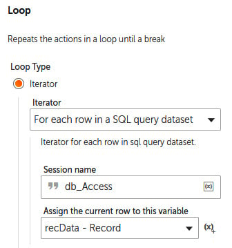
    


13. Click on **Save**.

14. We will also add a **Message box** so that we can see each record as
    the bot iterates through the dataset. To do this, add the **Message
    box** action , ensuring it is within the
    **Loop** action .

15. Set the following properties for the **Message
    box** action:

    **Enter the message box window title**:
    `Reading a SQL Dataset`

    **Enter the message to display**: `Type: |$recData[0]$|`

    `Orders: |$recData[1]$|`

    `Quantity: |$recData[2]$|`

    `Profit: |$recData[3]$|`

    **Scrollbar after lines**: `30` (*default value*)

    **Close message box after**: *Checked*

    **Seconds**: `5`

    The properties should look like the following screenshot:

    
    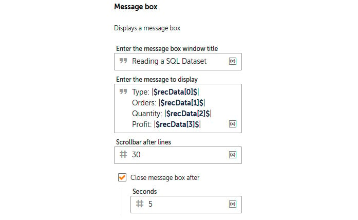
    


16. Click on **Save**.

17. The only action remaining is to add the
    **Database: Disconnect** action. To do this, add the **Database:
    Disconnect** action , ensuring it is aligned
    to the **Database: Connect** action  and not inside
    the **Loop** action .

18. Set the following property for the **Database: Disconnect** action
    :

    **Session name**: `db_Access`

    The property should look like the following screenshot:

    
    
    


19. Click on **Save**. Your development interface
    for this section should look like the following screenshot:


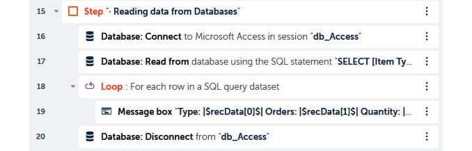


That\'s how we retrieve and read data from a database. No matter how you
have created your session, the preceding lab will work on all
database types. Go ahead and run your bot. You should get a **Message
box** for each record retrieved. A CSV file,
`Chapter15_Sales.csv`, will also be generated with results.
This output file should look like the following screenshot:


**Task:** Reading data from SQLite

Just out of curiosity, if you want to try reading
data from the SQLite database, you can use the following connections and SQL
statements to retrieve your dataset:

**SQL statement to retrieve data from the sample SQLite database:**


```
Connection string: SqLite Database - Chapter15_SQLite.db
SQL Statement: SELECT * FROM playlists
```


The output CSV file should look like this:


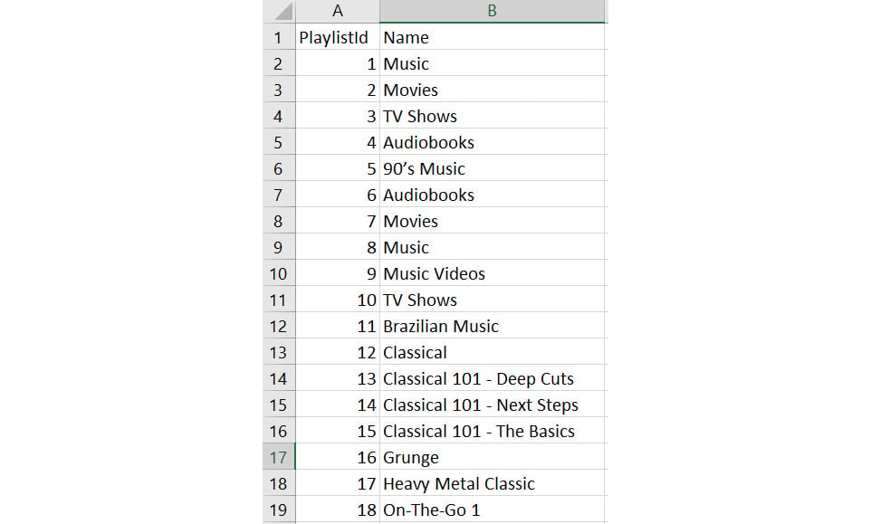


Now that you know everything about retrieving data, let\'s make things
more interesting. In the next section, you will learn how to run action
queries against your database. This is updating records, inserting new
records, and deleting records.


Updating databases 
==================

Let\'s start this lab by performing the following steps:

1.  Add a **Step**, set the **Title** property as
    `Updating to Databases`, and then
    click on **Save**.

2.  Again, we will add our connection to the Access database, dragging
    the **Database: Connect** action , ensuring it
    is within the **Step** action .

3.  As you\'ve done previously, set the following properties for the
    **Database: Connect** action:

    **Session name**: `db_Access`

    **Connection mode**: **User defined**

    **Database type**: **Microsoft Access**

    **Database file path**: **Desktop file** --
    `C:\Hands-On-RPA-with-AA-Sample-Data\Chapter15_Access.accdb`

    The properties should look like the following screenshot:

    
    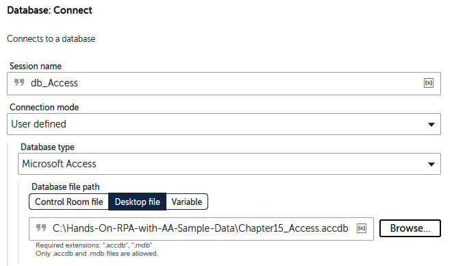
    


4.  Click on **Save**.

5.  Add another **Step** , ensuring it is within
    the previous **Step**  property as
    \"`Inserting data - INSERT Statement"`,
    and then click on **Save**.

6.  Add another **Step** , ensuring it is aligned
    to the **Step** , set the **Title** property as
    \"`Updating data - UPDATE Statement"`, and then click on
    **Save**.

7.  Add another **Step** , ensuring it is aligned
    to the **Step** , set the **Title** property as
    \"`Deleting data - DELETE Statement"`, and then click on
    **Save**.

8.  Finally, add the **Database: Disconnect** action just below line
    **25**, ensuring it is aligned to the **Database: Connect** action
    and not inside the **Step** .

9.  Set the following property for the **Database: Disconnect** action
    :

    **Session name**: `db_Access`

    The property should look like the following screenshot:

    
    
    


10. Click on **Save**. Your development interface for this section
    should look like the following screenshot:


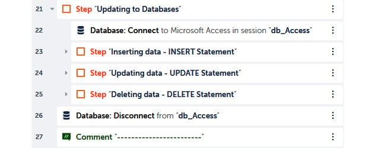


That\'s great! We now have a structure for our lab. We have a
single connection and a single disconnect action. While the bot has the
session open to the Access database, we can add the three different
types of action statements. We will start with inserting data.


Inserting data 
--------------

The Access database,
`Chapter15_Access.accdb`, has a table called
`tblTypes`. This table consists of all the product types sold.
There is only one field in this table, called `ItemType`.
Currently, there are 12 records in this table, as you can see:


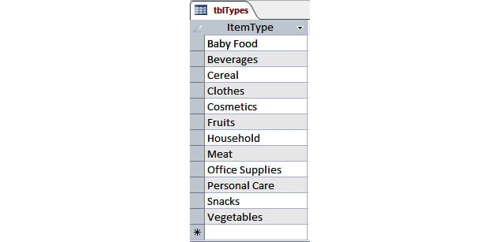


In the lab, our bot will insert a new type of product,
`Electrical`. This will bring the total record count to 13. To
insert this new record, the SQL statement would be as follows:


```
INSERT INTO tblTypes (ItemType) VALUES 'Electrical';
```


Let\'s start this lab by performing the following steps:

1.  To add this `Insert` SQL statement, add the **Database:
    Insert/Update/Delete** action , ensuring it is
    inside **Step** .

2.  Set the following properties for the **Database:
    Insert/Update/Delete** action:

    **Session name**: `db_Access`

    **Statement**:
    `INSERT INTO tblTypes (ItemType) VALUES 'Electrical';`

    The properties should look like the following
    screenshot:

    
    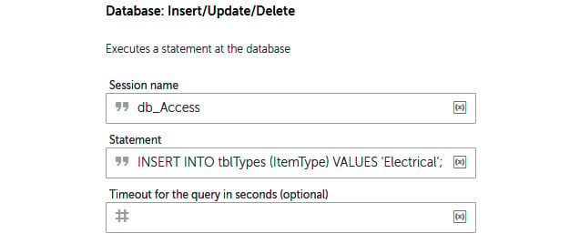
    


3.  Click on **Save**.

With the first SQL statement done, this will invoke the bot to add a new
record in the `tblTypes` table. We will run the bot once all
three statements are done. Let\'s now move on to the next one, where you
will learn how to execute an **Update** SQL statement.


Updating data 
-------------

For this lab, we will continue working
with the `tblTypes` table. One item in the table is
`Fruits`. We will configure our bot to update this value to
`Fresh Fruits`. The SQL statement to apply this update would
be as follows:


```
UPDATE tblTypes SET ItemType = "Fresh Fruits" WHERE ItemType = "Fruits"
```


Let\'s start this lab by performing the following steps:

1.  To add this `Update` SQL statement, add the **Database:
    Insert/Update/Delete** action , ensuring it is
    inside the **step** .

2.  Set the following properties for the **Database:
    Insert/Update/Delete** action:

    **Session name**: `db_Access`

    **Statement**:
    `UPDATE tblTypes SET ItemType = "Fresh Fruits" WHERE ItemType = "Fruits"`

    The properties should look like the following screenshot:

    
    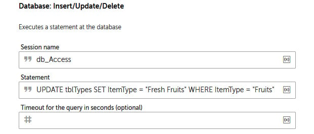
    


3.  Click on **Save**.

Thus, the second SQL statement is done. This will update the
`Fruits` value to `Fresh Fruits` in the
`tblTypes` table. There is now one more
SQL statement to do, and that\'s the `Delete` statement.


Deleting data 
-------------

This is the final lab for this lab;
you will learn how to apply a `Delete` SQL statement. Again,
we will work on the same table, `tblTypes`. In this example,
we want the bot to delete the record where the `ItemType`
value is `Cereal`. The SQL statement to apply this
`Delete` statement would be as follows:


```
DELETE FROM tblTypes WHERE ItemType ="Cereal";
```


Let\'s start this lab by performing the following steps:

1.  To add this `Delete` SQL statement, add the **Database:
    Insert/Update/Delete** action , ensuring it is
    inside the **step** .

2.  Set the following properties for the **Database:
    Insert/Update/Delete** action:

    **Session name**: `db_Access`

    **Statement**:
    `DELETE FROM tblTypes WHERE ItemType ="Cereal";`

    The properties should look like the following screenshot:

    
    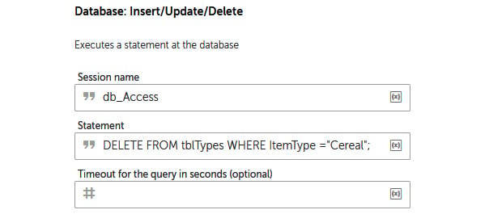
    


3.  Click on **Save**. The development interface
    for this entire section should look like the following screenshot:


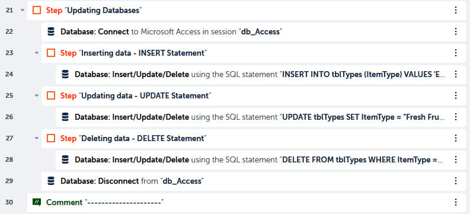


That\'s the final SQL statement! You now know how to automate all three
of the SQL action queries. This will allow you to add RPA automation to
your database-related manual tasks. Go ahead and run the bot. After the
bot has completed, the `ItemTypes` table should
be looking like this:


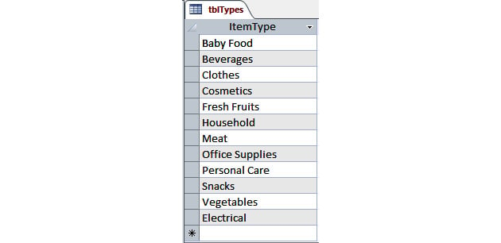


You can see that a new record with the value `Electrical` has
been inserted, the `Fruits` value has been updated to
`Fresh Fruits`, and the record with the `Cereal`
value has been deleted.


Summary 
=======

This lab has taken you into the world of automation with databases.
As you worked through the different lab, you have learned how
to connect to various types of databases. Aside from connecting, 
you have acquired the skills needed to
read, update, insert, and delete data from your databases. All this
automation will help reduce the time you spend on manual tasks daily.
