Lab: Building Modular Bots and Sub-Tasks 
==========================================

In this lab, we will cover the following:

-   Designing modular task bots
-   Running sub-task bots
-   Passing variables between main and sub-task bots
-   A working example walk-through


Technical requirements 
======================


In order to install the Automation Anywhere Bot agent, you\'ll need the
following:

-   Google Chrome
-   A completed registration with Automation Anywhere  Community
    Edition
-   A successful login to Automation Anywhere  Community Edition
-   A successfully registered local device
-   Successfully downloaded sample data from GitHub


Running sub-task bots 
=====================


For our given scenario, the main task bot runs
one sub-task bots. To run a sub-task bot from within your main task
bot, you need to use the **Task Bot** package. This package contains
actions such as **Pause**, **Run**, and **Stop**. The **Run** action
will run another task. The configuration of this action includes the
following:

-   Specifying the location of the task bot
-   Specifying any input variables
-   Specifying the repeatable status of the task


Sub-task 1 -- Get the non-system table names from a SQLite database 
-------------------------------------------------------------------

This task will need the
following inputs and outputs:

-   **Inputs**: From the main task, the SQLite database path as a
    `String` type variable -- `strFile_SqLiteDB`
-   **Outputs**: To the main task, all the table names separated by a
    comma and stored as a single `String` type variable --
    `strTableNames`


Main task -- Export the SQLite database tables to Excel 
-------------------------------------------------------

This task will need the
following inputs and
outputs:

-   **Inputs**: None

-   **Outputs**: The SQLite database path as a `String` type
    variable -- `strFile_SqLiteDB`

    The table name as a `String` type variable --
    `strTableNames`

This clearly outlines the communication of variables between the tasks.
We can see what inputs are needed for each task and what values will be
outputted. We have a complete picture of what our main and sub-task
should look like. In the next section, we can start actually building
our modular bot.


Working example walk-through 
============================


You will now start building the modular task bot
as described in our scenario. We have got the main and sub-bot designs
to guide us. We will build two bots in total -- one main task bot and
one sub-task bot. For this scenario, we will use the sample
`Chapter15_SQLite.db` database. Firstly, let\'s give our bots some names; we will name
them as follows:

-   `Chapter16_Sub_GetSqLiteTableNames`
-   `Chapter16_Main_SqLiteToMS`


Building a bot -- Chapter16\_Sub\_GetSqLiteTableNames 
-----------------------------------------------------

This bot connects to a SQLite database and then runs a SQL statement to
get all the non-system table names. The statement we are using is as
follows:


```
SELECT name FROM sqlite_master WHERE type='table' and name Not Like 'sqlite%';
```


The bot will then loop through all the records, appending the value to a
string while separating them with a comma. This string will be the
output variable. We will begin by creating the variables and adding the
comments.

Let\'s start this walk-through; follow the steps given here:

1.  Log in to **Control Room**.

2.  Create a new bot and call it
    `Chapter16_Sub_GetSqLiteTableNames` in the
    `\Bot\` folder.

3.  Create a `String` type variable
    called `strTableNames` and set the following property:

    **Use as output**: *Checked*

4.  Click on **Save**.

5.  Create a `String` type variable called
    `strFile_SqLiteDB` and set the following property:

    **Use as input**: *Checked*

6.  Click on **Save**.

7.  Create a `Record` type variable called
    `recTableName` and click on **Save**.

8.  Create a `Number` type variable called
    `numCounter` and click on **Save**.

9.  Add a new **Comment** action as `"---------------------"`
    on line **1** and click on **Save**.

10. Add a new **Comment** action as
    `"** Inputs: strFile_SqLiteDB"` on line **2** and click on
    **Save**.

11. Add a new **Comment** action as
    `"** Outputs: strTableNames"` on line **3** and click on
    **Save**.

12. Add a new **Comment** action as `"---------------------"`
    on line **4** and click on **Save**.

13. Add a new **Comment** action as
    `"-------- Initialize variables"` on line **5** and click
    on **Save**.

14. Add a new **Comment** action as
    `"--------- Get table names"` on line **6** and click on
    **Save**.

15. Add a new **Comment** action as
    `"-------- Create comma separated string"` on line **7**
    and click on **Save**.

16. Add a new **Comment** action as `"---------------------"`
    on line **8** and click on **Save**; your
    initial development interface should look like the following figure:

    
    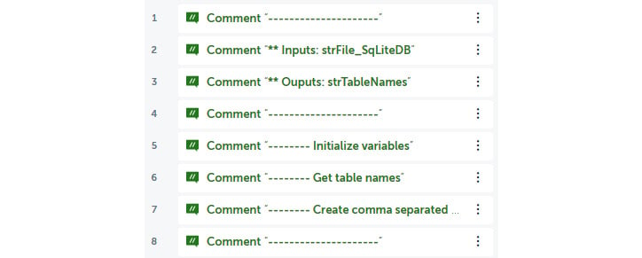
    

17. Firstly, we must initialize the output variable by adding the
    **String: Assign** action just below line **5**.

18. Set the following properties for **String: Assign** action on line
    **6**:

    **Select the source string variable(s) value (optional)**: *(null)*

    **Select the destination string variable**: **strTableNames -
    String**

    The properties should look as shown in the following figure:

    
    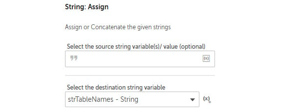
    


19. Click on **Save**.

20. Next, we initialize our `numCounter` variable by adding
    the **Number: Assign** action just below line **6**.

21. Set the following properties for the **Number: Assign** action on
    line **7**:

    **Select the source string variable/ value**: `0`

    **Select the destination number variable**: **numCounter - Number**

    The properties should look as shown in the following figure:

    
    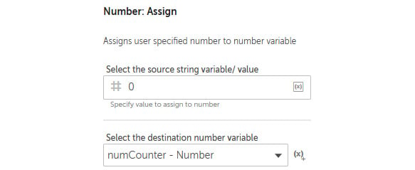
    


22. Click on **Save**. This section of the
    development interface should look as shown in the following figure:

    
    

23. Now we can start working with the SQLite database; first, to
    establish a connection, drag the **Database: Connect** action just
    below line **8**. You are now ready to start setting the properties.

24. Set the following properties for the **Database: Connect** action on
    line **9**:

    **Session name**: `db_SqLite`

    **Connection mode**: **User defined**

    **Database type**: **SqLite**

    **Database file path**: **Desktop file** --
    `$strFile_SqLiteDB$`

    The properties should look as shown in the
    following figure:

    
    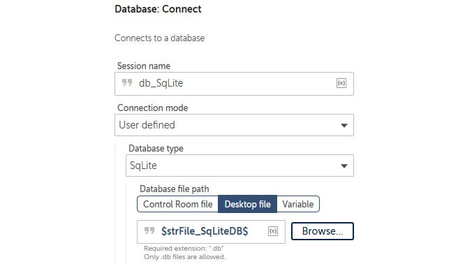
    

25. Click on **Save**.

26. To run the SQL statement to get the table names, add the **Database:
    Read from** action just below line **9**.

27. Set the following properties for the **Database: Read from** action
    on line **10**:

    **Session name**: `db_SqLite`

    **Enter SELECT Statement**:
    `SELECT name FROM sqlite_master WHERE type='table' and name Not Like 'sqlite%';`

    The properties should look as shown in the
    following figure:

    
    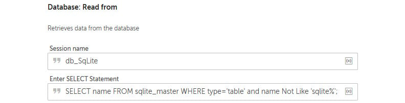
    

28. Click on **Save**; this section of the development interface should
    look as shown in the following figure:

    
    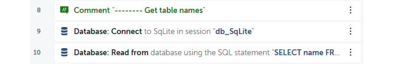
    

29. The bot needs to loop through the resulting dataset and create a
    comma-separated string. To do this, we start by adding the **Loop**
    action; drag the **Loop** action just below line **11**.

30. Set the following properties for the **Loop** action on line **12**:

    **Loop Type**: **Iterator**

    **Iterator**: **For each row in a SQL query dataset**

    **Session name**: `db_SqLite`

    **Assign the current row to this variable**: **recTableName --
    Record**

    The properties should look as shown in the
    following figure:

    
    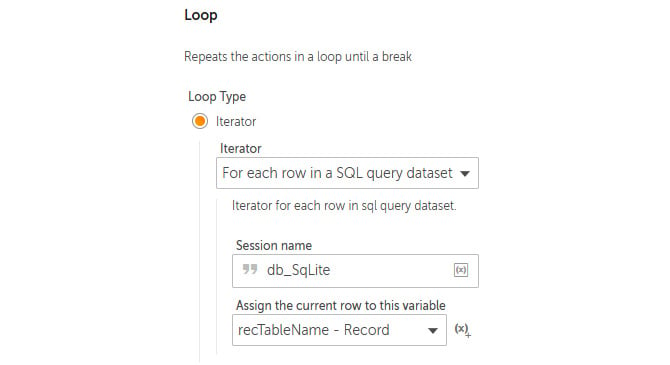
    


31. Click on **Save**.

32. As the bot is now in the **Loop** action, the counter needs to be
    incremented by adding the **Number: Increment** action just below
    line **12**, ensuring that it is within the **Loop** action on line
    **12**.

33. Set the following properties for the **Number: Increment** action on
    line **13**:

    **Enter number**: `$numCounter$`

    **Enter increment value**: `1`

    **Assign the output to variable**: **numCounter - Number**

    The properties should look as shown in the
    following figure:

    
    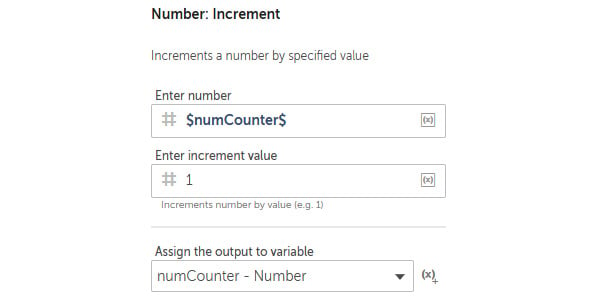
    


34. Click on **Save**.

35. As we build the comma-separated string, we must ensure that no comma
    is added before the first value. To do this, add the **If** action
    just below line **13**, ensuring that it is within the **Loop**
    action on line **12**.

36. Set the following properties for the **If** action on line **14**:

    **Condition**: **Number condition**

    **Source value**: `$numCounter$`

    **Operator**: **Equals to (=)**

    **Target value**: `1`

    The properties should look as shown in the
    following figure:

    
    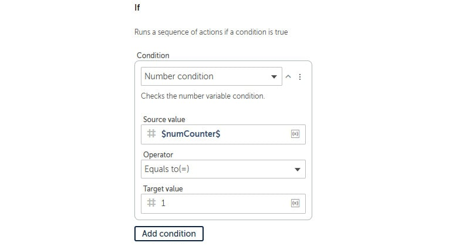
    


37. Click on **Save**.

38. Here, we assign the first value to the output string by adding the
    **String: Assign** action just below line **14**, ensuring that it
    is within the **If** action on line **14**.

39. Set the following properties for the **String: Assign** action on
    line **15**:

    **Select the source string variable value**:
    `$recTableName[0]$`

    **Select the destination string variable**: **strTableNames -
    String**

    The properties should look as shown in the
    following figure:

    
    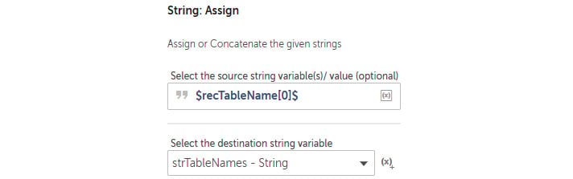
    


40. Click on **Save**.

41. To add all the table names following the first record, add the **If:
    Else** action just below line **15**, ensuring that it is within the
    **If** action on line **14**, and then click on **Save**.

42. Continue to add the comma-separated values to the output string by
    adding the **String: Assign** action just below line **16**,
    ensuring that it is within the **If: Else** action on line **16**.

43. Set the following properties for the **String: Assign** action on
    line **17**:

    **Select the source string variable value**:
    `$strTableNames $, $recTableName[0]$`

    **Select the destination string variable**: **strTableNames -
    String**

    The properties should look as shown in the
    following figure:

    
    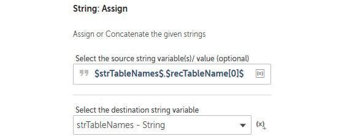
    


44. Click on **Save**.

45. We can now close the session by adding the **Database: Disconnect**
    action just below line **17**, ensuring that it is not within the
    **Loop** action on line **12**.

46. Set the following properties for the **Database: Disconnect** action
    on line **18**:

    **Session name**: `db_SqLite`

    The properties should look as shown in the following figure:

    
    
    


47. Click on **Save**; the development interface for this section should
    look as shown in the following figure:


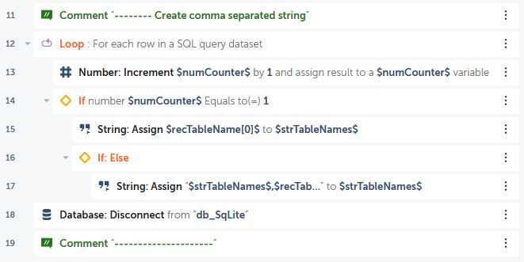


Good job! That\'s the second sub-bot built. This bot will extract all
the non-system tables from any SQLite database. It just needs the
database file path. The output should be a comma-separated string.


In the next section, you will build the main bot and run the
sub-bot from within this main bot.


Building a bot -- Chapter16\_Main\_SqLiteToMS 
------------------------------------------------

You are now ready to integrate all these smaller bots to perform the
overall task. We want our bot to run the first sub-bot, followed by the
second sub-bot. We then need to take the output from the second sub-bot
and split the comma-separated string into a list. The bot will then
iterate through this list while running the third bot. You will get the
practical experience of passing and receiving variables from these bots
as we build. We will begin by creating the
variables and adding some steps.

Let\'s start this walk-through by executing the following steps:

1.  Log in to **Control Room**.

2.  Create a new bot and call it
    `Chapter16_Main_SqLiteToMS` in the `\Bot\`
    folder.

3.  Create a `String` type variable called
    `strTableName` and set the following property:

    **Use as output**: *Checked*.

4.  Click on **Save**.

5.  Create a `String` type variable called
    `strFile_SqLiteDB` and set the following property:

    **Use as output**: *Checked*.

6.  Click on **Save**.


12. Create a `Dictionary` type variable with a subtype of
    `String`, name it `dctTableNames`, and click on
    **Save**.

13. Add a new **Comment** action as `"---------------------"`
    on line **1** and click on **Save**.

14. Add a new **Comment** action as
    `"** outputs: strFile_SqLiteDB, strTableName"`
    on line **2** and click on Save.

15. Add a new **Comment** action as `"---------------------"`
    on line **3** and click on **Save**.

16. Add a new **Comment** action as
    `"-------- Initialize variables"` on line **4** and click
    on **Save**.

18. Add step just below line **5**, set
    the **Title** property as
    `Get table names from SqLite database`, and click on
    **Save**.
    

24. Continue initializing variables; add the **String: Assign** action
    just below line **5**.

25. Set the following properties for the **String: Assign** action on
    line **6**:

    **Select the source string variable value**:
    `C:\Hands-On-RPA-with-AA-Sample-Data\Chapter15_SQLite.db `

    **Select the destination string variable**: **strFile\_SqLiteDB -
    String**

    The properties should look as shown in the following figure:

    
    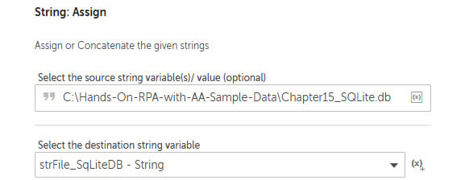
    

26. Click on **Save**.


33. Now it is time to call the sub-task bot. To do this, add the
    **Task Bot: Run** action.

34. Set the following properties for the **Task Bot: Run** action on
    line **11**:

    **Task Bot to run**: **Control Room file** --
    `Bots\Chapter16_Sub_GetSqLiteTableNames`

    **Input values**: **Set strFile\_SqLiteDB**: *Checked* -
    `$strFile_SqLiteDB$`

    **Do not repeat**: *Selected*

    **Assign the output to variable (optional)**: **dctTableNames --
    Dictionary of Strings**

    The properties should look as shown in the
    following figure:

    
    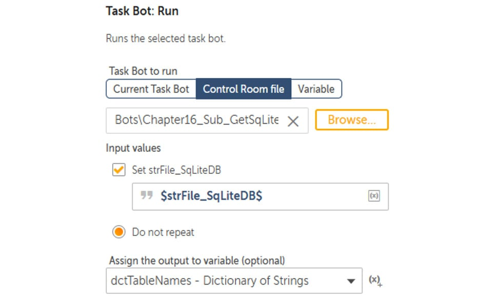
    


35. Click on **Save**; this section of the development interface should
    look as shown in the following figure:

    
    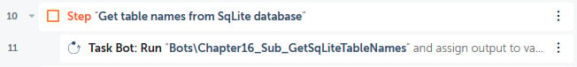
    

Go ahead and run your main bot. It will run the sub-bot and perform the whole process.


Summary 
=======


There has been a lot covered in this lab, giving you the skills
needed to understand and design modular bots.

In the next lab, we will be looking beyond Automation Anywhere. You
will learn how to use external scripts, including VBScript and Python
scripts, to enhance the functionality of your bots. You will also
discover how to pass parameters between your scripts and your bot,
opening up even more automation possibilities.
