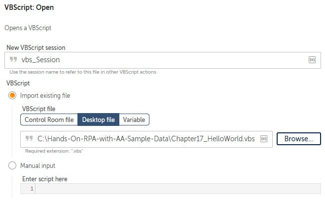

Lab : Data Manipulation and Scripting 
======================================

In this lab, we will be using the following packages:


We will look at the different types of scripts that can be executed as
well as passing parameters. The walk-throughs will take you through each
stage step by step, giving you valuable practical experience. Some
sample scripts are included as part of the GitHub repository. These will
be used in the walk-throughs.

In this lab, we will cover the following:

-   Running VBScripts

For Automation Anywhere to run scripts, you have to first create a
session with a script file or an inline script. Once a session is
established, the script or functions can be executed. When finished, the
session needs to be closed.


Technical requirements 
======================


In order to install the Automation Anywhere Bot agent, the following
requirements are necessary:

-   Google Chrome
-   You must have completed registration with Automation Anywhere 
    Community Edition
-   You must have logged on successfully to Automation Anywhere 
    Community Edition
-   A successfully registered local device
-   Successfully downloaded sample data from GitHub


Running VBScripts 
=================


**VBScripts** are widely used by developers as
they are easily written using any text editor, such as Notepad. A
VBScript file will have the `.vbs`
extension. This file may contain just a script or some functions and
functions may return a value. Automation Anywhere allows you to import a
VBScript file as well as letting you write the script inline within
Automation Anywhere. You can also pass parameters to a script and
receive a return value. In the next sections, you will learn all about
importing a script file and inline scripting. You will also learn how to
pass parameters to a script and get return values from functions. We can
start the walk-through by building the outline using steps and comments.

Let\'s start this walk-through by executing the following steps:

1.  Log in to **Control Room**.
2.  Create a new bot and call it
    `Chapter17 – External Scripts` in the folder
    `\Bot\`.
3.  Add a new **Comment** action as `"---------------------"`
    on line **1**, and click on **Save**.
4.  Add a **Step** just below line **1**, set the **Title** property as
    `Running VbScripts`, and click on **Save**.
5.  Add a new **Comment** action below line **2** as
    `"------ Importing a script file"`, ensuring it is within
    the **Step** on line **2** and click on **Save**.
6.  Add a new **Comment** action below line **3** as
    `"------ Writing in-line scripts"`, ensuring it is within
    the **Step** on line **2** and click on **Save**.
7.  Add a new **Comment** action below line **4** as
    `"------ Passing parameters"`, ensuring it is within the
    **Step** on line **2** and click on **Save**.
8.  Add a new **Comment** action below line **5** as
    `"------ Returning value from functions"`, ensuring it is
    within the **Step** on line **2** and click on **Save**.
9.  Add a new **Comment** action below line **6** as
    `"---------------------"`, ensuring it is not within the
    **Step** on line **2** and click on **Save**. The development
    interface should look like this:


We are now ready to start working with VBScripts.
We will start with how to run a script file.


Importing a script file 
-----------------------

In order to make this guide as easy as possible, we will start with a
simple *Hello World* example. We want our VBScript
to show a message box containing the text `Hello World`. A
VBScript file is available in the GitHub repository called
`Chapter17_HelloWorld.vbs`. You can run this file
independently just by double-clicking on it. The file only has one line
of code as shown here:


In the following walk-through, you will learn how to create a session
and run this script file.

Let\'s start this walk-through by executing the following steps:

1.  To create our session with the script file, drag the **VBScript:
    Open** action just below line **3**, ensuring it is within the
    **Step** on line **2**.

2.  Set the following properties for the **VBScript: Open** action on
    line **4**:

    **New VBScript session**: `vbs_Session`

    **VB Script**: **Import existing file**

    **VB Script file**: **Desktop file** --
    `C:\Hands-On-RPA-with-AA-Sample-Data\Chapter17_HelloWorld.vbs`

    The properties should look as shown in the
    following screenshot:

    
    
    


3.  Click on **Save**.

4.  To run the script file, drag the **VBScript: Run function** action
    just below line **4**, ensuring it is within the **Step** on line
    **2**.

5.  Set the following properties for the **VBScript: Run function**
    action on line **5**:

    **VBScript session**: `vbs_Session`

    The properties should look as shown in the following screenshot:

    
    
    


6.  Click on **Save**.

7.  We just have to close the session. Add the **VBScript: Close**
    action just below line **5**, ensuring it is within the **Step** on
    line **2**.

8.  Set the following properties for the
    **VBScript: Close** action on line **6**:

    **VBScript session**: `vbs_Session`

    The properties should look as shown in the following screenshot:

    
    
    


9.  Click on **Save**. The development interface for this section should
    look like this:


That\'s it -- your bot will now run the VBScript file. Give it a test.
The VBScript should show the following message
box:


In the next section, you will learn how to use
inline scripting instead of using a script file.


Writing inline scripts 
----------------------

Instead of using a script file, you can write the lines of script
directly within the action. In the following walk-through, we will
demonstrate how to create an inline script to
perform the same *Hello World* example as before.

Let\'s start this walk-through by executing the following steps:

1.  Add the script line when you create the session by dragging the
    **VBScript: Open** action just below line **7**, ensuring it is
    within the **Step** on line **2**.

2.  Set the following properties for the **VBScript: Open** action on
    line **8**:

    **New VBScript session**: `vbs_Session`

    **VB Script**: **Manual input**

    **Enter script here**: **1**
    `msgbox "Hello World",,"In-Line Script File"` (press
    *Enter* to enter new lines)

    The properties should look as shown in the following screenshot:

    
    
    


3.  Click on **Save**.

4.  To run the script file, drag the **VBScript:
    Run function** action just below line **8**, ensuring it is within
    the **Step** on line **2**.

5.  Set the following properties for the **VBScript: Run function**
    action on line **9**:

    **VBScript session**: `vbs_Session`

    The properties should look as shown in the following screenshot:

    
    
    


6.  Click on **Save**.

7.  We just have to close the session. Add the **VBScript: Close**
    action just below line **9**, ensuring it is within the **Step** on
    line **2**.

8.  Set the following properties for the **VBScript: Close** action on
    line **10**:

    **VBScript session**: `vbs_Session`

    The properties should look as shown in the following screenshot:

    
    
    


9.  Click on **Save**. The development interface
    for this section should look like this:


Although this is a simple one-line script, it demonstrates how to write
your code directly within Automation Anywhere.
When you run the bot, the VBScript will show the following message box:


We have looked at running scripts both from a file and inline scripting.
In a number of cases, you will want to pass values to a script. In the
next section, you will learn how to pass parameters to a script file.


Passing parameters 
------------------

In this section, we will look at passing parameters. When passing
parameters to a VBScript, they need to be in the
form of a `List` type variable. A sample
script file is included in the GitHub repository, which takes two
parameters. This file is `Chapter17_InputParamters.vbs`. To
use a parameter within a VBScript, you need to utilize the following
syntax:


```
WScript.Arguments(0)
```


The index number (`0`) represents the item in the
`List` and it uses a zero index, so the first value is indexed
at `0`. The contents of the script file are as follows:


```
strValue01 = WScript.Arguments(0)
strValue02 = WScript.Arguments(1)
msgbox "Hello " & strValue01 & " " & strValue02,,"Input Parameters"
```


For this example, we will create two `String` type variables
and assign a first name and a surname as values. Then we will assign
these `String` variables to a `List` variable before
sending them to our script file.

Let\'s start this walk-through by executing the
following steps:

1.  Create two `String` type variables called
    `strFirstname` and `strSurname`.

2.  Create a `List` type variable called
    `lstParameters`.

3.  Assign the `strFirstname` variable with a value by adding
    the **String: Assign** action just below line **11**, ensuring it is
    within the **Step** on line **2**.

4.  Set the following properties for the **String: Assign** action on
    line **12**:

    **Select the source string variable(s)/ value (optional)**:
    `Husan` *(enter your first name)*

    **Select the destination string variable**: **strFirstname -
    String**

    The properties should look as shown in the following screenshot:

    
    
    


5.  Click on **Save**.

6.  Assign the `strSurname` variable with a value by adding
    the **String: Assign** action just below line **12**, ensuring it is
    within the **Step** on line **2**.

7.  Set the following properties for the **String:
    Assign** action on line **13**:

    **Select the source string variable(s)/ value (optional)**:
    `Mahey` *(enter your surname)*

    **Select the destination string variable**: **strSurname - String**

    The properties should look as shown in the following screenshot:

    
    
    


8.  Click on **Save**.

9.  To add this variable to the **List** type
    variable, drag the **List: Add item** action just below line **13**,
    ensuring it is within the **Step** on line **2**.

10. Set the following properties for the **List: Add item** action on
    line **14**:

    **List variable**: **lstParameters - List**

    **Item to be added**: **strFirstname - String**

    **Add Item**: **To end of list**

    The properties should look as shown in the following screenshot:

    
    
    


11. Click on **Save**.

12. Add the `strSurname` variable to the `List`
    variable by repeating *steps* *9* to *11* for the `String`
    variable `strSurname` just below line **14**.

13. We can now create our session by dragging the
    **VBScript: Open** action just below line **15**, ensuring it is
    within the **Step** on line **2**.

14. Set the following properties for the **VBScript: Open** action on
    line **16**:

    **New VBScript session**: `vbs_Session`

    **VB Script**: **Import existing file**

    **VB Script file**: **Desktop file** -
    `C:\Hands-On-RPA-with-AA-Sample-Data\Chapter17_InputParamters.vbs`

    The properties should look as shown in the following screenshot:

    
    
    


15. Click on **Save**.

16. To run the script file and pass the
    `List` type variable, add the **VBScript: Run function**
    action just below line **16**, ensuring it is within the **Step** on
    line **2**.

17. Click on **Save**.

18. Set the following properties for the **VBScript: Run function**
    action on line **17**:

    **VBScript session**: `vbs_Session`

    **Parameters**: **lstParameters - List**

    The properties should look as shown in the following screenshot:

    
    
    


19. Click on **Save**.

20. We just have to close the session. Add the **VBScript: Close**
    action just below line **17**, ensuring it is within the **Step** on
    line **2**.

21. Set the following properties for the
    **VBScript: Close** action on line **18**:

    **VBScript session**: `vbs_Session`

    The properties should look as shown in the following screenshot:

    
    
    


22. Click on **Save**. The development interface for this section should
    look like this:


When you run the bot to test it, it will run the specified VBScript
file, which should display a message box with the
first name and surname. The values were passed from the bot to the
script. This gives you an understanding of how to pass values from
Automation Anywhere to a VBScript. In the next section, we will look at
receiving values from a VBScript function.


Returning values from functions 
-------------------------------

With VBScripts, we know a function can return a value. You can also send
a `Number`, `String`, or `Boolean` type
variable to a function. In this section, you will learn about passing a
parameter and receiving a result from a function
within a VBScript. A sample script file is included in the GitHub
repository; the file we will use is called
`Chapter17_Functions.vbs`.

In this walk-through, we will run the function called
`procSquareRoot`. This function takes a `Number`
type variable and calculates the square root of this value. This value
is then returned back to Automation Anywhere.

For this walk-through, we will create two variables, a
`String` type for the output and a `Number` type for
the input. Then we will assign these `String` variables to a
`List` variable before sending them to our script file.

Let\'s start this walk-through by executing the following steps:

1.  To store the input value, create a `Number` type variable
    called `numValue`.

2.  To store the returned value, create a `String` type
    variable called `strReturnValue`.

3.  Assign the `numValue` variable with a value by adding the
    **Number: Assign** action just below line **19**, ensuring it is
    within the **Step** on line **2**.

4.  Set the following properties for the **Number: Assign** action on
    line **20**:

    **Select the source string variable/ value**: `25`

    **Select the destination number variable**: **numValue - Number**

    The properties should look as shown in the following screenshot:

    
    
    


5.  Click on **Save**.

6.  We can now create our session by dragging the
    **VBScript: Open** action just below line **20**, ensuring it is
    within the **Step** on line **2**.

7.  Set the following properties for the **VBScript: Open** action on
    line **16**:

    **New VBScript session**: `vbs_Session`

    **VB Script**: **Import existing file**

    **VB Script file**: **Desktop file** --
    `C:\Hands-On-RPA-with-AA-Sample-Data\ Chapter17_Functions.vbs`

    The properties should look as shown in the following screenshot:

    
    
    


8.  Click on **Save**.

9.  To run the function in the script file and
    pass the `numValue` variable and get the results to the
    `strReturnValue` variable, add the **VBScript: Run
    function** action just below line **21**, ensuring it is within the
    **Step** on line **2**.

10. Set the following properties for the **VBScript: Run function**
    action on line **22**:

    **VBScript session**: `vbs_Session`

    **Enter name of function to be executed**:
    `procSquareRoot`

    **Parameters**: **numValue -- Number**

    **Assign the output to variable**: **strReturnValue - String**

    The properties should look as shown in the following screenshot:

    
    
    


11. Click on **Save**.

12. To close the session, add the **VBScript: Close** action just below
    line **22**, ensuring it is within the **Step** on line **2**.

13. Set the following properties for the
    **VBScript: Close** action on line **23**:

    **VBScript session**: `vbs_Session`

    The properties should look as shown in the following screenshot:

    
    
    


14. Click on **Save**.

15. Add a **Message box** to see the results returned by dragging the
    **Message box** action just below line **23**, ensuring it is within
    the **Step** on line **2**.

    Set the following properties for the **Message box** action on line
    **24**:

    **Enter the message box window title**:
    `Returning values from a VbScript`

    **Enter the message to display**:
    `Returned value: $strReturnValue$`

    **Scrollbar after lines**: `30`

    The properties should look as shown in the
    following screenshot:

    
    
    


16. Click on **Save**. The development interface
    for this section should look like this:


Great work! That\'s all you need to know about VBScripts. When you run
this bot, it should take the value of `25` from Automation
Anywhere and pass it to the VBScript function. The function will
calculate the square root and return the results
back to Automation Anywhere. The following message box should appear
showing the results:


In the next section, we will explore running Pythion scripts.

You can see how easily you can run external
scripts using Automation Anywhere. Even when you may think certain tasks
would require a lot of action using Automation Anywhere and would be
better executed using a script, you can easily achieve them using RPA.


Summary 
=======


In this lab, you learned how to run scripts as
well as how to pass parameters and receive return values. The
step-by-step walk-throughs guided you through each stage and provided
key practical skills, as well as boosting your confidence in working
with RPA.

The next lab will explore error management. You will learn all about
handling exceptions and errors while your bot performs its tasks.
Specifically, we will look at the different types of methods used to
manage errors, such as **Try**, **Catch**, **Finally**, and **Throw**.
The walk-through will demonstrate a real-life example showing how it all
works. This will enable you to build a robust RPA solution.
