Lab 10: Error Handling
======================

In this lab, we will be using the following packages:

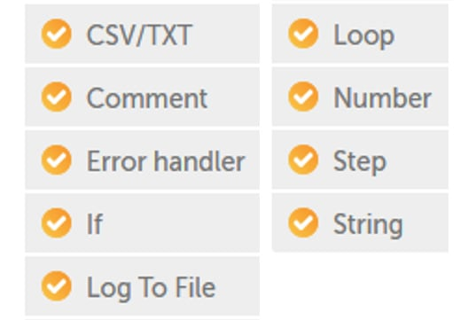

There is a real-life scenario lab example in this lab. The
lab will take you through each stage step by step, giving you
valuable practical experience. The input file needed for the
lab is included as part of the GitHub repository.

In this lab, we will cover the following:

-   Error handling with Automation Anywhere
-   Understanding **Try**, **Catch**, **Finally**, and **Throw** actions
-   Building an error-handling routine

Technical requirements 
======================

In order to install the Automation Anywhere Bot agent, the following
requirements are necessary:

-   Google Chrome
-   You must have completed registration with Automation Anywhere 
    Community Edition
-   You must have logged on successfully to Automation Anywhere 
    Community Edition
-   A successfully registered local device
-   Successfully downloaded sample data from GitHub

Error handling with Automation Anywhere
=======================================

This lab works with the file
`Chapter18_Products.csv`. This file has a list of products
within each business segment, and the contents look as shown in the
following screenshot:

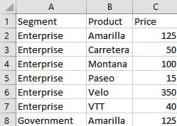

For this scenario, the bot will perform the following tasks:

1.  Read every record from the CSV file
    `Chapter18_Products.csv`.
2.  Apply a `10%` discount to the price.
3.  Create a new CSV file with updated prices called
    `Chapter18_UpdatedProducts.csv`.

This should be a relatively simple bot. From the tasks, we can identify
a few variables that will be needed. We will need four variables:

-   One `Record` type variable to read the product record
-   One `String` type variable to assign the discounted price
    to be written to the new file
-   Two `Number` type variables -- one for the current price
    and the other for the calculated discounted price

We can start the lab by building the
outline using steps and comments and creating the variables we will
need:

1.  Log into **Control Room**.

2.  Create a new bot and call it `Chapter18 – Error Handling`
    in the `\Bot\ folder`.

3.  Add a new **Comment** action as `"---------------------"`
    on line **1** and click on **Save**.

4.  Add a new **Comment** action below line **1**,
    `"------ create new csv output file"`, and click on
    **Save**.

5.  Add a new **Comment** action below line **2**,
    `"------ open products csv file and read each row"`, and
    click on Save.

6.  Add a **Step** just below line **3**, set the **Title** property as
    `calculate new price and update file`, and click on
    **Save**.

7.  Add a new **Comment** action below line **4**,
    `"------ close products csv file"`, ensuring it is not
    within the **Step** on line **4** and click on **Save**.

8.  Add a new **Comment** action below line **5**,
    `"---------------------"`, and click on **Save**. The
    initial development interface should look like this:

    
    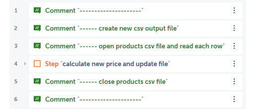
    

9.  Create two `Number` type variables called
    `numPrice` and `numNewPrice`.

10. Create a `String` type variable
    called `strNewPrice`.

11. Create a `Record` type variable called
    `recProduct`. The variables should look as shown in the
    following screenshot:

    
    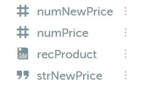

12. To create our new output CSV file, we will use the **Log to file**
    action. Starting with creating the file headers, drag the **Log to
    file** action just below line **2**.

13. Set the following properties for the **Log to file** action on line
    **3**:

    **File path**:
    `C:\Hands-On-RPA-with-AA-Sample-Data\Chapter18_UpdatedProducts.csv`

    **Enter text to log**: `Segment,Product,Price`

    **Append timestamp**: *Unchecked*

    **When logging**: **Overwrite existing log file**

    **Encoding**: **ANSI** *(default value)*

    The properties should look as shown in the
    following screenshot:

    
    
    

14. Click on **Save**.

15. To create the session with our *products* CSV file, drag the
    **CSV/TXT: Open** action just below line **4**.

16. Set the following properties for the **CSV/TXT: Open** action on
    line **5**:

    **Session name**: `csv_Session`

    **File path**: **Desktop file** -
    `C:\Hands-On-RPA-with-AA-Sample-Data\Chapter18_Products.csv`

    **Contains header**: *Checked*

    **Delimiter**: **Comma**

    The properties should look as shown in the
    following screenshot:

    
    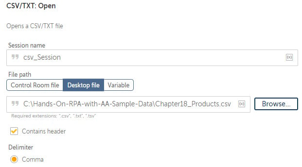
    

17. Click on **Save**.

18. To close the session that we have just created, drag the **CSV/TXT:
    Close** action just below line **7**.

19. Set the following property for the **CSV/TXT: Close** action on line
    **8**:

    **Session name**: `csv_Session`

    The property should look as shown in the following screenshot:

    
    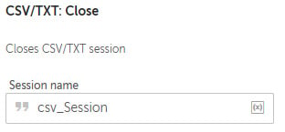
    

    Click on **Save**. The development interface
    for this section should look like this:

    
    
    

20. Next, we can add the **Loop** to read each record from the
    *products* file. Drag the **Loop** action just below line **6**,
    ensuring it is within the **Step** on line **6**.

21. Set the following properties for the **Loop**
    action on line **7**:

    **Loop Type**: **Iterator**

    **Iterator**: **For each row in CSV/TXT**

    **Session name**: `csv_Session`

    **Assign the current row to variable**:
    `recProduct - Record`

    The properties should look as shown in the following screenshot:

    
    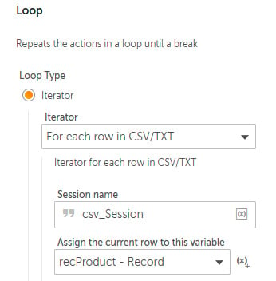
    

22. Click on **Save**.

23. `current price` is the third column in the CSV *products*
    file. This would give it an index value of **2**. To assign this
    value to our variable, add the **String: To number** action just
    below line **7**, ensuring it is within the **Loop** on line **7**.

24. Set the following properties for the **String:
    To number** action on line **8**:

    **Enter the string**: `$recProduct[2]$`

    **Assign the output to variable**: **numPrice - Number**

    The properties should look as shown in the following screenshot:

    
    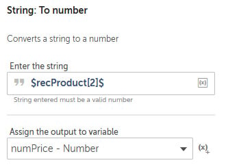
    

25. Click on **Save**.

26. The discounted price can now be calculated. To calculate and assign
    the new price to our variable `numNewPrice`, add the
    **Number: Assign** action just below line **8**, ensuring it is
    within the **Loop** on line **7**.

27. Set the following properties for the **Number: Assign** action on
    line **9**:

    **Select the source string variable/ value**:
    `$numPrice$ * 0.9`

    **Select the destination number variable**: **numNewPrice - Number**

    The properties should look as shown in the
    following screenshot:

    
    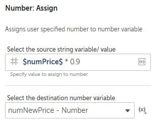
    

28. Click on **Save**.

29. As the new price will be saved to a file, it needs to be converted
    to a `String`. To do this, add the **Number: To string**
    action just below line **9**, ensuring it is within the **Loop** on
    line **7**.

30. Set the following properties for the **Number: To string** action on
    line **10**:

    **Enter a number**: `$numNewPrice$`

    **Enter number of digits after decimal**: `2`

    **Assign the output to variable**: **strNewPrice - String**

    The properties should look as shown in the following screenshot:

    
    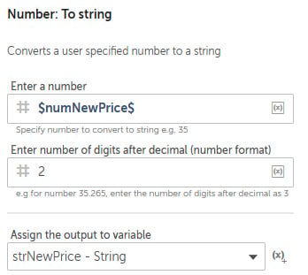
    

31. Click on **Save**.

32. The last part is to append the record with the discounted price to
    the output CSV file. To do this, drag the **Log to file** action
    just below line **10**, ensuring it is within the **Loop** on line
    **7**.

33. Set the following properties for the **Log to
    file** action on line **11**:

    **File path**:
    `C:\Hands-On-RPA-with-AA-Sample-Data\Chapter18_UpdatedProducts.csv`

    **Enter text to log**:
    `$recProduct[0]$,$recProduct[1]$,$strNewPrice$`

    **Append timestamp**: *Unchecked*

    **When logging**: **Append to existing log file**

    **Encoding**: **ANSI** *(default value)*

    The properties should look as shown in the following screenshot:

    
    
    

34. Click on **Save**. The development interface
    for this section should look like this:

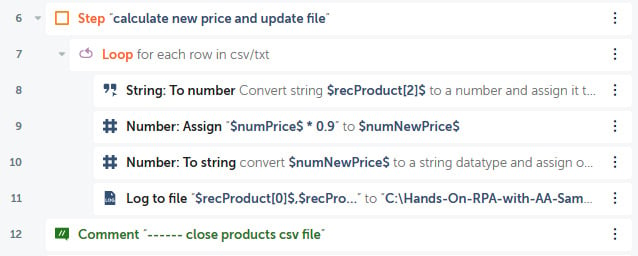

That\'s great work! You have now built the bot. This bot is should be
working with no issues. Go ahead and run the bot. A file called
`Chapter18_UpdatedProducts.csv` should be generated. This file
will have the same records as the input file but with the new discounted
price.

This is all good -- your bot will always work as
long as the input file has no issues. But what will happen if the input
file has an issue? How will your bot behave?

Modifying the input file and introducing an error 
-------------------------------------------------

Let\'s have a look at what happens when we modify
the input file and introduce an error:

1.  Open the input file, `Chapter18_Products.csv`, in Notepad
    and delete the value `15` for the fourth record as shown
    here:

    
    
    

2.  Save and close the file.

The bot hasn\'t been modified in any way, only the input file has. This
reflects a real-life scenario where your bot is dependent on some source
data. Try running the bot again with the updated input file. While
processing, the bot will fail. You will get the following message from
Automation Anywhere:

The message refers to line **8**. This is when the bot assigns the price
to the variable `numPrice`. Having this value as *null* has
caused the bot to fail. Also in the message box, you will also notice
that the bot stopped processing at the point of
failure. The output file will only have three records in it. As soon as
the bot encountered the error, it stopped.

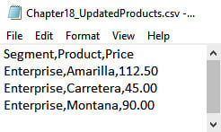

Ideally, we would like our bot to log the error details in a file
instead of a message box. Then it would be great if the bot continued
with the rest of the records instead of just stopping. We will now
continue with the lab.

In this lab, you will add an error handler that will manage the
new error that we have introduced. To manage the error, we will need
some additional variables. A `Number` type variable is needed
to store the error line number. As this will also be added to a log
file, a `String` type will also be required for the line
number. Another `String` type variable will also be needed to
store the error description.

We can start the lab by creating the
variables we will need as follows:

1.  Log into **Control Room**.

2.  Create a `Number` type variable called
    `numErrLine`.

3.  Create two `String` type variables called
    `strErrLine` and `strErrDesc`.

4.  Lines **8** to **11** are when the bot is processing each record.
    This is what we want in our **Try** action for the error handler.
    Add the **Error handler: Try** action just below line **7**,
    ensuring it is with the **Loop** on line **7**, and click on
    **Save**. The development interface should look as shown in the
    following screenshot:

    
    
    

5.  To add our processing lines within the **Error handler: Try** block,
    select lines **10** to **13** and drag them to just under line
    **8**, so they are within the **Error handler: Try** action on line
    **8**, and click on **Save**. The development interface should look
    as shown in the following screenshot:

    
    
    

6.  The error block has now been created. We need to instruct the bot on
    what to do if an error occurs from within the error block. To do
    this, set the following properties for the **Error handler: Catch**
    action on line **13**:

    **Exception**: **AllErrors**

    **Assign exception message to**: **strErrDesc - String**

    **Assign line number to**: **numErrLine - Number**

    The properties should look as shown in the
    following screenshot:

    
    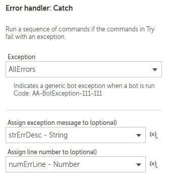
    

7.  Click on **Save**.

8.  All the actions within the **Error handler: Catch** block will be
    executed when an error occurs. We want the bot to output the error
    to a log file. The `numErrLine` variable will need to be
    converted to a `String` type variable for the log file. To
    convert this, add the **Number: To string** action just below line
    **13**, ensuring it is within the **Error handler: Catch** action on
    line **13**.

9.  Set the following properties for the **Number:
    To string** action on line **14**:

    **Enter a number**: `$numErrLine$`

    **Enter number of digits after decimal**: `0`

    **Assign the output to variable**: **strErrLine - String**

    The properties should look as shown in the following screenshot:

    
    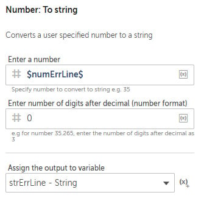
    

10. Click on **Save**.

11. The last part is to append the invalid record
    to a log file. To do this, drag the **Log to file** action just
    below line **14**, ensuring it is within the **Error handler:
    Catch** action on line **13**.

12. Set the following properties for the **Log to file** action on line
    **15**:

    **File path**:
    `C:\Hands-On-RPA-with-AA-Sample-Data\Chapter18_ErrorLog.csv`

    **Enter text to log**:
    `Desc: $strErrDesc$, Line: $strErrLine$, (Record: $recProduct[0]$,$recProduct[1]$,$recProduct[2]$)`

    **Append timestamp**: *Checked*

    **When logging**: **Append to existing log file**

    The properties should look as shown in the following screenshot:

    
    
    

13. Click on **Save**. The development interface for this section should
    look like this:

    
    
    

    You have now added an error-handling routine
    within your bot. If an error occurs while the bot is processing
    lines **9** to **12**, which make up our **Try** block, it will move
    directly to the **Catch** block on line **13**. The **Catch** block
    will log the details in our error log file, which is created if one
    does not already exist. Following the error, the bot will continue
    processing the rest of the input file.

14. Now run the bot once more. You will notice it will perform the task
    without an error occurring. Once it is complete, you can examine the
    files generated. The output file
    `Chapter18_UpdatedProducts.csv` will have all the records
    with the discounted prices, with the exception of the record we
    modified. The invalid record will not be present in the output file:

There will also be an error log file generated,
`Chapter18_ErrorLog.csv`. This file will have the details of
the error and the invalid record:

Great work! You have successfully added an error-handling routine. You
can rest assured that your bot is more resilient and can handle files
that may have invalid data.

Summary 
=======

This lab has been all about building robust, resilient bots that can
get up and continue even when they fall over. We have explored the
**Error handler** package and the actions available. The lab
provided the practical skills to actually build your own error-handling
routine. Having a good error-handling routine is key to the success of
your bots.