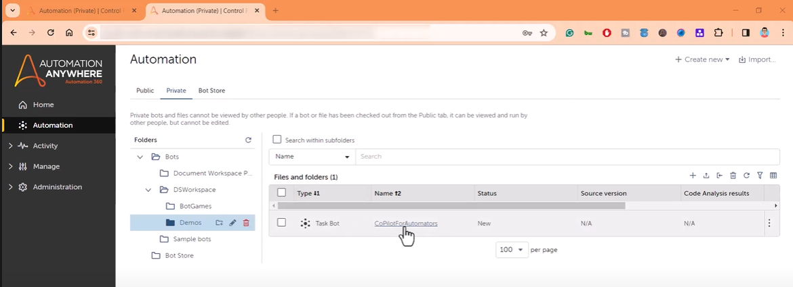
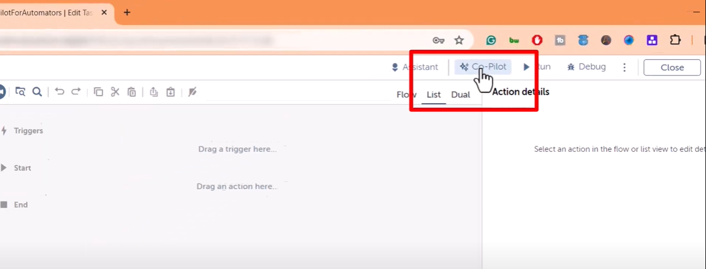
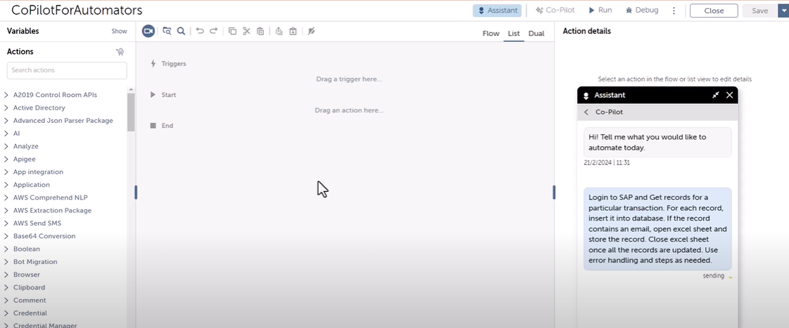
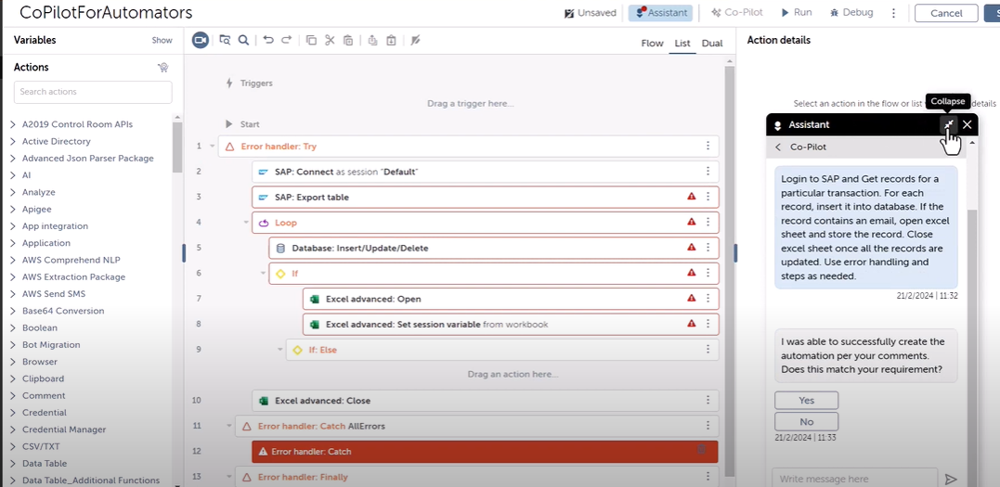
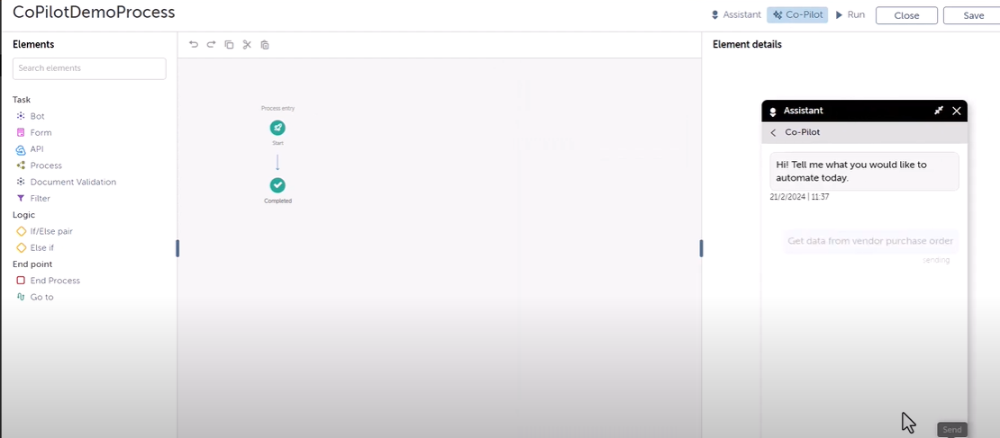
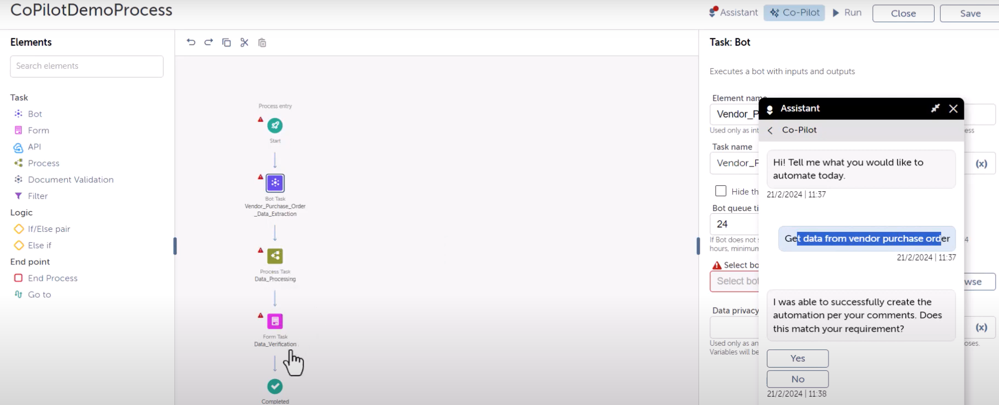

# Lab: Automation Anywhere Copilot for Automators

## Introduction

Welcome to this lab on Automation Anywhere's Copilot for Automators. In this session, you will learn about the Copilot feature offered by Automation Anywhere. This feature assists in constructing automation bots by simply providing prompts. This hands-on lab will guide you through creating a bot task, utilizing the Copilot feature to generate a bot skeleton, and refining the generated bot to meet specific requirements.

**IMPORTANT:** This lab can only be done with Enterprise Automation Anywhere edition. API task feature is not available in Commmunity edition.

## Objectives

- Understand the Copilot feature in Automation Anywhere.
- Learn to create a bot task and use Copilot to generate a bot skeleton.
- Explore how to refine and customize the bot skeleton based on specific needs.

## Prerequisites

- Access to Automation Anywhere Control Room.
- A valid Automation Copilot for Automator license and Bot Creator license.

## Step 1: Open Automation Anywhere Control Room

1. Log into the Automation Anywhere Control Room.
2. Navigate to the `My Bots` section.
3. Create a new bot task or select an existing one. For this lab, we will create a new task named `Copilot for Automation`.



## Step 2: Access the Copilot Feature

1. In the bot editor window, locate the `Co-Pilot` option next to your assistant.
2. If you do not see the Copilot option, ensure you have the required licenses (Automation Copilot for Automator and Bot Creator).




## Step 3: Creating the Bot Skeleton with Copilot

1. In the Copilot option, you will find a space to write a prompt. This prompt should be within 2,000 characters.
2. Enter the following prompt as an example:

```
Login to SAP and Get records for a particular transaction. For each record, insert it into the database. If the record contains an email, open excel sheet and store the record. Close the Excel sheet once all the records are updated. Use error handling and steps as needed.
```

3. Click `Send` to submit your prompt to the Copilot.



## Step 4: Review and Refine the Generated Bot Skeleton

1. Observe the generated bot skeleton in the editor. It will include actions like connecting to SAP, exporting tables, inserting data into a database, and working with Excel sheets.
2. You may need to add or refine certain steps, such as establishing a database connection or specifying error handling mechanisms, based on the initial prompt's details.



## Step 5: Utilizing Copilot for Process-Level Automation

1. Create a new process and give it a relevant name, like `CoPilotDemoProcess`.
2. Use the Copilot feature at the process level to write prompts for broader tasks, such as `Get data from vendor purchase orders`.



3. Review the tasks and flows generated by Copilot, and refine them as needed for your specific process requirements.



## Feedback and Iteration

- After using Copilot to generate bots and processes, you can provide feedback on the accuracy and usefulness of the generated code.
- Use this feedback to iterate on your prompts and improve the automation tasks generated by Copilot.

## Conclusion

In this lab, you have learned how to use Automation Anywhere's Copilot to streamline the creation of bot tasks and processes. By providing detailed prompts, you can quickly generate bot skeletons and refine them to meet your automation needs. Experiment with different prompts and scenarios to fully leverage the capabilities of Copilot in your automation projects.

