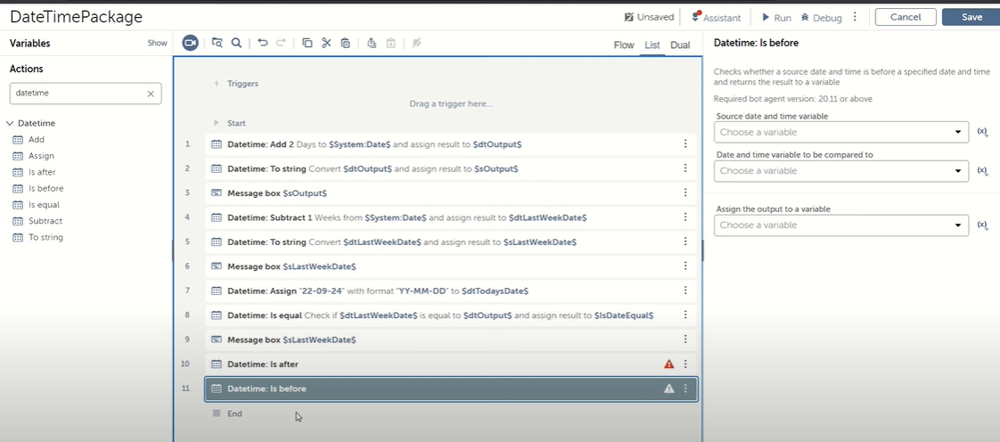
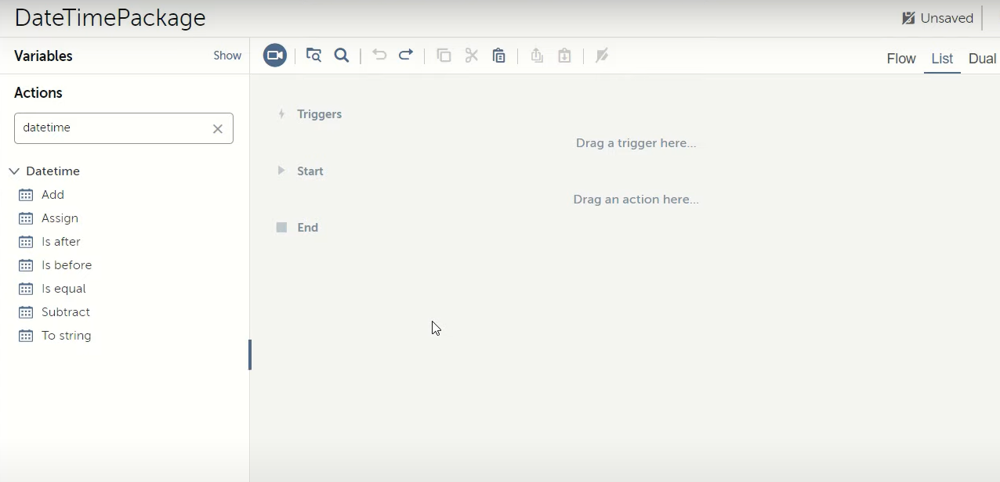
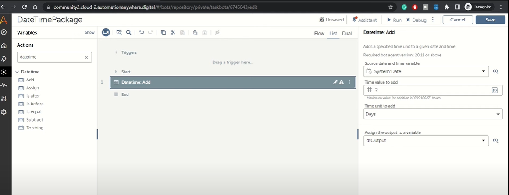
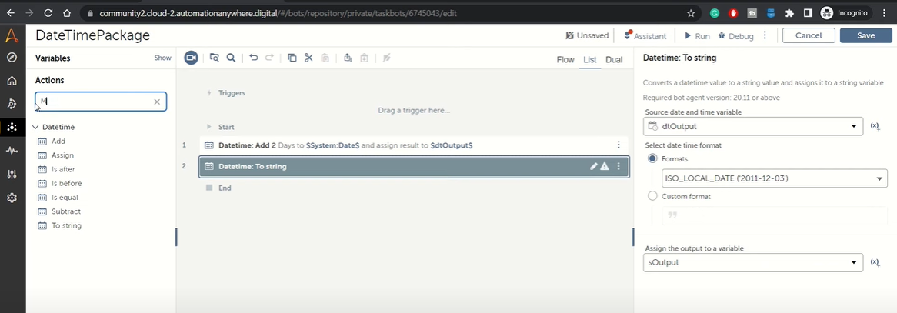
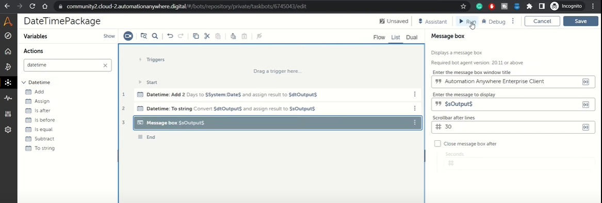
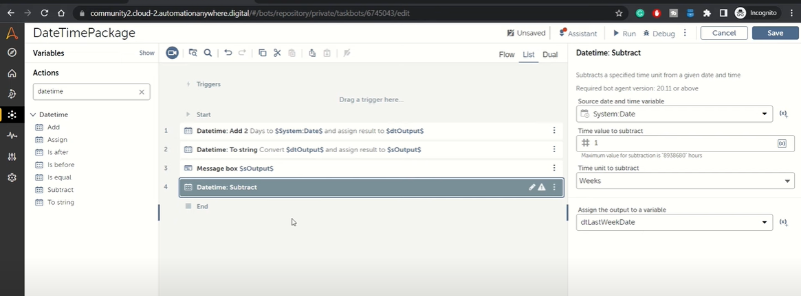
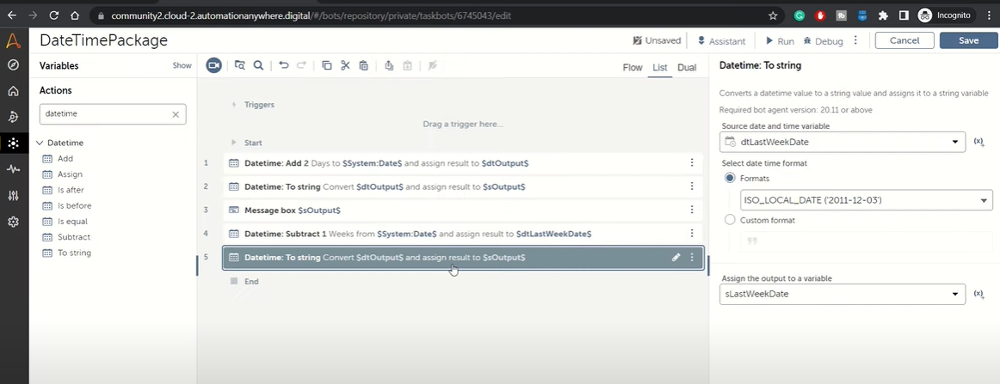
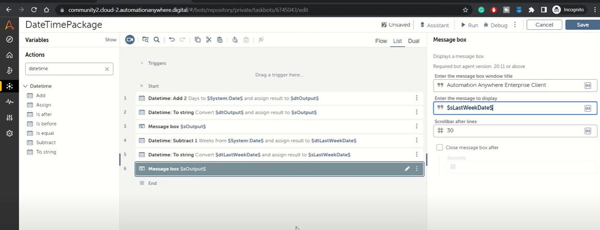
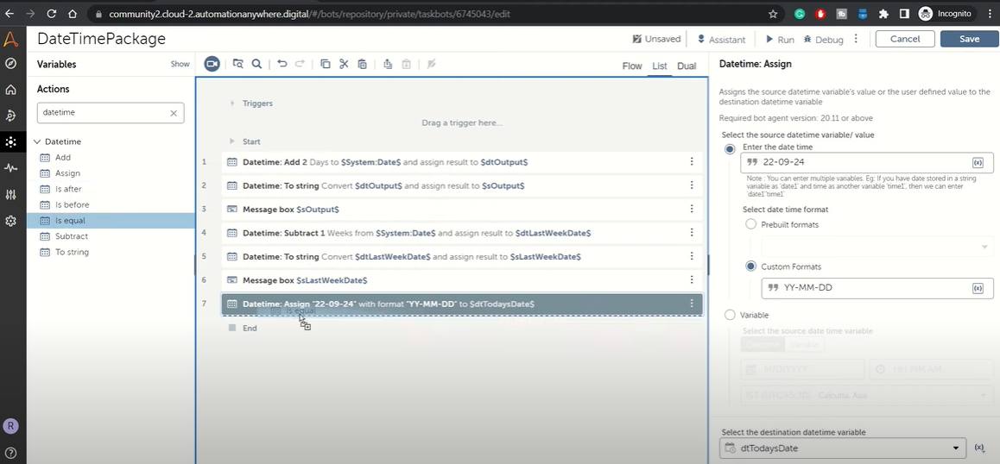

# Lab: Working with Date Time Package

### Introduction

Welcome to the RPA feed. In this session, we'll be diving into the Date Time package in Automation Anywhere A360. This package is essential for handling date and time operations within your bots, offering a range of actions to manipulate date and time values easily.

### Objectives

- Understand the purpose and applications of the Date Time package in A360.
- Learn to use various actions within the Date Time package for date and time manipulation.
- Explore actions like Add, Subtract, Convert Date to String, Assign, Is After, Is Before, and Is Equal.

#### Datetime Package

Datetime Package helps you to use the DateTime data type of variable and perform various date operations using the available Actions.

Actions available in a Datetime package are:

**Assign** Assign action is used to assign a date in string format to the datetime variable. This action lets you assign an existing Datetime variable into a Datetime variable.

**Add** Add action enables us to add the date and time units to the existing DateTime value. For example, if you add value as “2” and specify the unit as “Days” then it will add 2 days into the existing date.

**Subtract** Subtract action enables us to decrease the date and time units from the existing DateTime value. For example, if you put the value as “2” and specify the unit as “Days” then it will reduce 2 days from the existing date.

**ToString** ToString action helps us to convert a datetime value to a string value. When we want to pass the datetime value as a string to the child bot or in the same bot, we can use this action.

**IsEqual** Size action lets us compare the two dates. It always returns a boolean value. If the two values are equal, it returns True otherwise it returns False.

**IsAfter** IsAfter action compares two Datetime variables and verifies if the date of the source variable is after the date of the comparison variable, and stores the output to a Boolean variable.

**IsBefore** IsBefore action compares two Datetime variables and verifies if the date of the source variable is before the date of the comparison variable, and stores the output to a Boolean variable.

### Task:

Explore datatime package in depth and create bot as shown below:

You can get help from below steps to complete the datetime bot task.

## Step 1: Access the Date Time Package

1. Open your A360 bot interface.
2. From the actions pane, search for "Datetime" to view all available actions within the Date Time package.

## Step 2: Explore Date Time Package Actions

### Add and Subtract Actions

1. **Add Action:** Allows you to add a specific time unit (e.g., days, minutes) to an existing date. For example, adding two days to the current date.

2. **Subtract Action:** Enables subtracting a specific time unit from an existing date, such as subtracting one week from the current date.

#### Configuration:

- Drag the Add or Subtract action into your bot.
- Select a source date time variable (e.g., system date).
- Specify the value to add or subtract and the unit (days, weeks, etc.).
- Capture the output in a new date time variable.

### Convert Date to String

Converts a date time variable to a string variable with a specified format.

#### Steps:

1. Use the "Convert Date to String" action after adding or subtracting to convert the output date time variable to a string format.
2. Choose the format for the date string or define a custom format.
3. Store the result in a string variable.

### Assign Action

Used to initialize a date time variable with a specific value.

#### Configuration:

1. Drag the Assign action to your bot.
2. Enter the date time value and select the desired format.
3. Assign the value to a destination variable.

### Comparison Actions: Is After, Is Before, Is Equal

These actions allow you to compare dates to determine their relative positions or equality.

#### Usage:

1. **Is Equal:** Compares two dates to check if they are the same.
2. **Is After/Is Before:** Determines if one date is after or before another date.
3. Output for these actions is a Boolean value indicating the result of the comparison.

## Step 3: Run and Test Your Bot

1. After configuring the actions, run your bot to test the date time manipulations.
2. Observe the outputs, especially for Add, Subtract, and comparison actions, to ensure they work as expected.

## Conclusion

The Date Time package simplifies date and time manipulations, enabling you to perform complex date-based operations with ease. By familiarizing yourself with these actions, you can enhance your bots' capabilities to handle date and time data efficiently.
